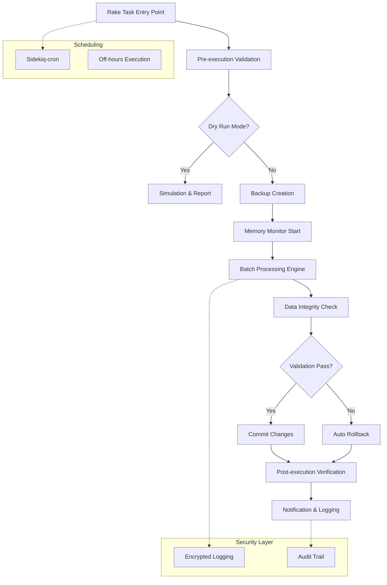
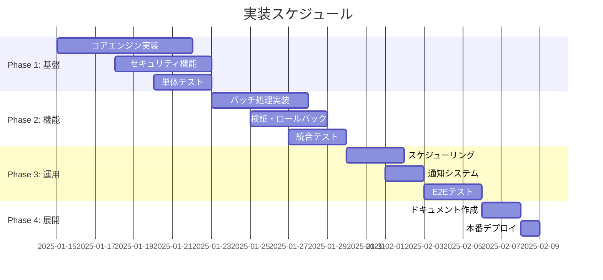

# リリース時データパッチ・バッチ処理 Rake タスク設計

## サマリー
```yaml
プロジェクト名: StockRx データパッチ・バッチ処理システム
作成日: 2025-01-14
作成者: Development Team
レビュアー: TBD
ステータス: Draft
```

### 一言要約（30文字以内）
> 安全で効率的なリリース時データパッチシステム

### エレベーターピッチ（3文以内）
> StockRxの本番環境において、大量データの安全な修正・処理を自動化するrakeタスクシステムを構築する。セキュリティ・検証・ロールバック機能を備え、リリース作業の品質と効率を向上させる。メモリ効率とスケジューリング機能により運用負荷を最小化する。

---

## 1. なぜこの取り組みが必要か（Why）

### 解決すべき課題
```
【現状の問題】
・リリース時のデータパッチが手動実行で属人化
・本番環境での大量データ処理時の安全性不足
・複数テーブル間のデータ整合性保証が困難
・処理失敗時のロールバック手順が未整備
↓
【結果として起きていること】
・リリース作業の長時間化とヒューマンエラーリスク
・データ不整合による障害発生の可能性
・夜間・休日リリース時の運用負荷増大
・メモリ不足による処理中断のリスク
↓  
【ビジネスへの影響】
・サービス停止時間の延長
・データ品質の低下による顧客満足度への影響
・運用コスト増大と開発効率の低下
```

### ステークホルダー別の価値提案

| ステークホルダー | 現在の課題 | 提供する価値 | 成功の定義 |
|-----------------|-----------|-------------|-----------|
| **開発チーム** | 手動パッチ作業の属人化・時間消費 | 自動化による作業効率化と品質向上 | パッチ作業時間50%削減、エラー率90%削減 |
| **運用チーム** | 夜間・休日の緊急対応負荷 | スケジューリングと自動通知による負荷軽減 | 緊急対応件数70%削減 |
| **データチーム** | データ整合性チェックの手動実行 | 自動検証とロールバック機能 | データ不整合ゼロ、復旧時間80%短縮 |

---

## 2. 何を実現するか（What）

### ゴール（Goals）
1. **主要目標**: 本番環境での安全で効率的なデータパッチ・バッチ処理システムの構築
2. **副次目標**: 在庫関連データの大量処理における品質保証とトレーサビリティの確保
3. **長期目標**: 完全自動化されたリリースパイプラインへの基盤提供

### スコープ外（Non-goals）
- **含まないもの**: GUI管理画面、リアルタイム進捗表示、CSVレポート生成
- **将来の検討事項**: Webベースの実行管理ツール、ML活用した異常検知
- **他チームの責任範囲**: インフラ監視、データベース設定変更、セキュリティポリシー策定

### 成功指標（Success Metrics）

| 指標カテゴリ | 指標名 | 現在値 | 目標値 | 測定方法 |
|------------|--------|--------|--------|----------|
| **ビジネス指標** | パッチ作業時間 | 3-5時間 | 30分-1時間 | 作業ログ分析 |
| **技術指標** | データ処理スループット | 1000件/分 | 10000件/分 | バッチ処理ログ |
| **ユーザー体験** | リリース遅延発生率 | 20% | 5%以下 | プロジェクト管理ツール |

---

## 3. 誰のためか（Who）

### ユーザーストーリー

```gherkin
Feature: 安全なデータパッチ実行

  Scenario: 在庫データの一括更新
    Given 在庫管理システムに10万件のInventoryレコードが存在する
    When 開発者がprice_adjustment_patchタスクを実行する
    Then 全レコードの価格が指定した計算式で更新される
    And 実行前後のデータ整合性が保証される
    And 処理完了がSlackで通知される
    So that リリース時の価格改定作業が自動化される

  Scenario: Dry-runでの事前検証
    Given 複雑なデータパッチが予定されている
    When 開発者がdry_runオプション付きでタスクを実行する
    Then 実際のデータ変更は行われない
    And 処理内容と影響範囲がログに出力される
    And 事前に問題を発見できる
    So that 本番実行前にリスクを最小化できる

  Scenario: 処理失敗時の自動ロールバック
    Given データパッチ実行中にエラーが発生した
    When 検証フェーズで整合性チェックが失敗する
    Then 変更内容が自動的にロールバックされる
    And エラー詳細がログに記録される
    And 管理者に緊急通知が送信される
    So that データ破損を防止できる
```

### ペルソナ
- **プライマリユーザー**: 開発チームのリリース担当者（rakeTasks実行権限保有）
- **セカンダリユーザー**: 運用チーム（監視・通知受信）、データチーム（整合性検証）
- **影響を受ける人々**: 全システムユーザー（データ品質向上の恩恵）

---

## 4. どのように実現するか（How）

### アーキテクチャ概要



### 技術実装詳細

#### 4.1 コア実装

<details>
<summary>実装例を表示</summary>

```ruby
# lib/tasks/data_patch.rake
namespace :data_patch do
  desc "Execute data patch with safety checks"
  task :execute, [:patch_name] => :environment do |task, args|
    DataPatchExecutor.new(
      patch_name: args[:patch_name],
      dry_run: ENV['DRY_RUN'] == 'true',
      options: parse_patch_options
    ).execute
  end

  desc "List available patches"
  task :list => :environment do
    DataPatchRegistry.list_patches.each do |patch|
      puts "#{patch.name}: #{patch.description}"
    end
  end
end

# app/services/data_patch_executor.rb
class DataPatchExecutor
  include SecurityLogging
  include MemoryMonitor
  
  def initialize(patch_name:, dry_run: false, options: {})
    @patch_name = patch_name
    @dry_run = dry_run
    @options = options
    @execution_id = SecureRandom.uuid
  end

  def execute
    log_execution_start
    
    pre_execution_validation
    return dry_run_simulation if @dry_run
    
    ActiveRecord::Base.transaction do
      create_backup_point
      start_memory_monitoring
      
      result = execute_patch
      
      post_execution_verification(result)
      commit_or_rollback(result)
    end
    
    send_notifications(result)
    log_execution_complete
  rescue => error
    handle_execution_error(error)
  ensure
    cleanup_resources
  end

  private

  def execute_patch
    patch_class = DataPatchRegistry.find_patch(@patch_name)
    processor = BatchProcessor.new(
      batch_size: @options[:batch_size] || 1000,
      memory_limit: @options[:memory_limit] || 500 # MB
    )
    
    processor.process_with_monitoring do
      patch_class.new(@options).execute
    end
  end
end

# app/services/batch_processor.rb
class BatchProcessor
  def initialize(batch_size: 1000, memory_limit: 500)
    @batch_size = batch_size
    @memory_limit = memory_limit
    @processed_count = 0
  end

  def process_with_monitoring
    loop do
      check_memory_usage
      
      batch_result = yield(@batch_size, @processed_count)
      break if batch_result.empty?
      
      @processed_count += batch_result.size
      log_progress
      
      # Prevent memory leaks
      GC.start if @processed_count % (@batch_size * 10) == 0
    end
  end

  private

  def check_memory_usage
    current_memory = GetProcessMem.new.mb
    if current_memory > @memory_limit
      raise MemoryLimitExceededError, 
            "Memory usage #{current_memory}MB exceeds limit #{@memory_limit}MB"
    end
  end
end
```

</details>

#### 4.2 設定・初期化

```yaml
# config/data_patches.yml
patches:
  inventory_price_adjustment:
    description: "在庫アイテムの価格一括調整"
    target_tables: ["inventories"]
    estimated_records: 100000
    memory_limit: 1024
    batch_size: 2000
    
  batch_expiry_update:
    description: "期限切れバッチの状態更新"
    target_tables: ["batches", "inventory_logs"]
    estimated_records: 50000
    memory_limit: 512
    batch_size: 1000

security:
  log_encryption: true
  audit_retention_days: 90
  notification_channels:
    - slack
    - email

scheduling:
  default_timezone: "Asia/Tokyo"
  maintenance_windows:
    - start: "02:00"
      end: "04:00"
      days: ["sunday", "wednesday"]
```

#### 4.3 データモデル

| フィールド | 型 | 説明 | 制約 |
|-----------|-----|------|------|
| execution_id | String | 実行識別子 | UUID, NOT NULL |
| patch_name | String | パッチ名 | NOT NULL |
| status | Enum | 実行状態 | pending/running/completed/failed |
| dry_run | Boolean | Dry-run実行フラグ | DEFAULT false |
| started_at | DateTime | 開始日時 | NOT NULL |
| completed_at | DateTime | 完了日時 | |
| processed_records | Integer | 処理レコード数 | DEFAULT 0 |
| error_message | Text | エラーメッセージ | |
| rollback_performed | Boolean | ロールバック実行フラグ | DEFAULT false |

### テスト戦略

```ruby
# spec/services/data_patch_executor_spec.rb
describe DataPatchExecutor do
  let(:executor) { described_class.new(patch_name: 'test_patch') }

  context '正常系' do
    it 'パッチが正常に実行される' do
      expect { executor.execute }.to change { Inventory.count }
      expect(executor.execution_log).to include('completed successfully')
    end
    
    it 'Dry-runモードでは実際の変更が行われない' do
      executor = described_class.new(patch_name: 'test_patch', dry_run: true)
      expect { executor.execute }.not_to change { Inventory.count }
    end
  end
  
  context '異常系' do
    it 'メモリ制限超過時に適切にエラーハンドリングされる' do
      allow_any_instance_of(BatchProcessor).to receive(:check_memory_usage)
        .and_raise(MemoryLimitExceededError)
      
      expect { executor.execute }.to raise_error(MemoryLimitExceededError)
    end
    
    it 'データ整合性チェック失敗時に自動ロールバックされる' do
      allow(executor).to receive(:post_execution_verification).and_return(false)
      
      expect { executor.execute }.not_to change { Inventory.count }
      expect(executor.rollback_performed?).to be true
    end
  end
end
```

---

## 5. リスクと対策（Risks）

### 技術的リスク

| リスク | 影響度 | 発生確率 | 対策 | 担当 |
|--------|-------|---------|------|------|
| 大量データ処理時のメモリ不足 | High | Medium | バッチサイズ調整、メモリ監視機能 | 開発チーム |
| ロールバック処理の失敗 | High | Low | 段階的コミット、バックアップ検証 | 開発チーム |
| 複数テーブル間の整合性破綻 | Medium | Medium | 事前検証、トランザクション境界設計 | データチーム |
| 暗号化ログの性能影響 | Medium | Medium | 非同期ログ処理、ログレベル調整 | 運用チーム |

### ビジネスリスク

| リスク | 影響度 | 発生確率 | 対策 | 担当 |
|--------|-------|---------|------|------|
| 処理時間の長期化によるサービス影響 | High | Low | 段階的実行、処理時間制限 | 運用チーム |
| データパッチの誤実行 | High | Low | Dry-run必須化、承認フロー | 開発リーダー |
| 夜間実行時の障害対応遅延 | Medium | Medium | 自動通知、エスカレーション設定 | 運用チーム |

### 失敗の判定基準
- [ ] データ整合性チェックで10%以上の不整合検出
- [ ] メモリ使用量が制限値を30分以上継続
- [ ] 処理時間が予想時間の3倍を超過

---

## 6. いつ実施するか（When）

### 実装フェーズ



### マイルストーン

| フェーズ | 期限 | 完了条件 | 成果物 |
|---------|------|---------|--------|
| **Phase 1: 基盤** | 2025-01-23 | コアエンジンの単体テスト完了 | DataPatchExecutor, セキュリティモジュール |
| **Phase 2: 実装** | 2025-01-30 | バッチ処理・検証機能の統合テスト完了 | BatchProcessor, ValidationEngine |
| **Phase 3: 検証** | 2025-02-06 | 運用機能のE2Eテスト完了 | スケジューラー、通知システム |
| **Phase 4: 展開** | 2025-02-08 | 本番環境デプロイ完了 | 運用マニュアル、監視設定 |

---

## 7. 検証と学習（Validation）

### 仮説検証計画

```
If 自動化されたデータパッチシステムを導入したら、
Then リリース作業時間が50%削減され、データ不整合ゼロが実現され、
And 開発チームの生産性向上とサービス品質向上が実現されるだろう
```

### A/Bテスト計画（該当する場合）
- **対象**: 新旧パッチ実行方式の比較（開発環境）
- **期間**: 2週間
- **成功基準**: 作業時間短縮率、エラー発生率、開発者満足度

---

## 8. 運用と保守（Operations）

### 運用プロセス
1. **監視項目**: メモリ使用量、処理時間、エラー率、データ整合性
2. **アラート条件**: メモリ80%超過、処理時間3倍超過、整合性チェック失敗
3. **対応手順**: 自動ロールバック → 緊急通知 → 手動調査 → 原因分析

### ドキュメント計画
- [ ] 開発者向けガイド（パッチ作成・実行手順）
- [ ] 運用マニュアル（監視・トラブルシューティング）
- [ ] ユーザーガイド（基本的な使用方法）
- [ ] API仕様書（内部API・設定ファイル仕様）

### 教育・展開計画
- **内部トレーニング**: 開発チーム向け実装・運用研修（2時間 x 2回）
- **ユーザー教育**: 実行担当者向けハンズオン（1時間）
- **段階的展開**: 開発環境 → ステージング → 本番環境

---

## 9. 代替案の検討（Alternatives）

### 検討した代替案

| 案 | 概要 | 長所 | 短所 | 不採用理由 |
|----|------|------|------|------------|
| **案A: 手動スクリプト** | 従来通りの手動実行 | シンプル、既存知識活用 | 属人化、エラー率高 | 自動化要件を満たさない |
| **案B: GUI管理ツール** | Web画面からの実行管理 | 直感的操作、可視化 | 開発コスト高、複雑性 | スコープ外、投資対効果低 |
| **案C: 外部ツール活用** | Ansible/Jenkins等の活用 | 実績あり、機能豊富 | 学習コスト、運用複雑 | 既存システムとの親和性低 |

---

## 10. 補足情報（Appendix）

### 参考資料
- [Rails Guide: Custom Rake Tasks](https://guides.rubyonrails.org/command_line.html#custom-rake-tasks)
- [Sidekiq Best Practices](https://github.com/mperham/sidekiq/wiki/Best-Practices)

### 関連文書
- 要件定義書: このドキュメントの前段
- 技術仕様書: セキュリティ要件仕様、データベース設計書
- テスト計画書: 統合テスト・E2Eテスト仕様

### 用語集
| 用語 | 定義 |
|------|------|
| データパッチ | リリース時に実行するデータベース更新処理 |
| Dry-run | 実際の変更を行わない実行テスト |
| バッチ処理 | 大量データを効率的に処理する仕組み |
| ロールバック | 変更内容を元に戻す処理 |

---

## レビューチェックリスト

**ビジネス観点**
- [x] ビジネス価値が明確か（作業効率化、品質向上）
- [x] ROIが妥当か（開発コスト vs 削減効果）
- [x] リスクが網羅されているか（技術・ビジネス両面）

**技術観点**
- [x] 実装が実現可能か（既存技術スタック活用）
- [x] パフォーマンスへの影響は許容範囲か（メモリ監視機能）
- [x] セキュリティが考慮されているか（暗号化ログ、監査証跡）

**運用観点**
- [x] 運用負荷が現実的か（自動化・通知による負荷軽減）
- [x] 監視・アラートが適切か（メモリ・時間・整合性監視）
- [x] ロールバック計画があるか（自動ロールバック機能）

---

### 改訂履歴

| 日付 | バージョン | 変更内容 | 変更者 |
|------|-----------|---------|--------|
| 2025-01-14 | v1.0 | 初版作成 | Development Team |

---

**このドキュメントの使い方：**
1. フェーズごとに実装を進める際の設計ガイドとして活用
2. ステークホルダーレビュー時の論点整理資料として使用
3. 実装完了後は運用マニュアルの基礎文書として参照
4. 類似機能開発時のテンプレートとして再利用 