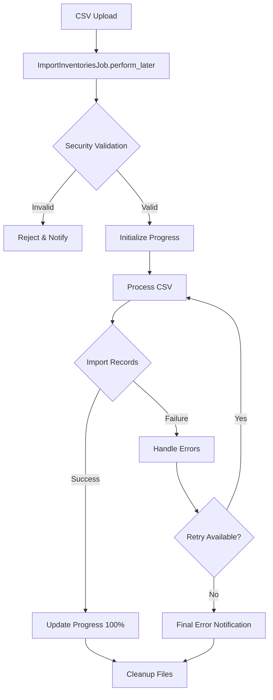

# ImportInventoriesJob Design Document

## Overview

ImportInventoriesJob is a Sidekiq background job responsible for processing CSV imports of inventory data. It provides enterprise-grade features including real-time progress tracking, comprehensive error handling, and security validations.

## Architecture

### Job Configuration

```ruby
class ImportInventoriesJob < ApplicationJob
  queue_as :imports
  sidekiq_options retry: 3, backtrace: true
```

- **Queue**: Dedicated `:imports` queue for isolation
- **Retry**: 3 attempts with exponential backoff
- **Timeout**: 300 seconds for large file processing

### Processing Flow



## Core Components

### 1. Security Validation

```ruby
def validate_file_security!(file_path)
  # File existence check
  raise CustomError::FileNotFoundError unless File.exist?(file_path)
  
  # Size validation (100MB limit)
  raise CustomError::FileTooLargeError if File.size(file_path) > 100.megabytes
  
  # Format validation
  raise CustomError::InvalidFileFormatError unless file_path.end_with?('.csv')
  
  # Path traversal prevention
  raise CustomError::SecurityError if file_path.include?('..')
end
```

### 2. Progress Tracking

Real-time progress updates via Redis and ActionCable:

```ruby
def update_progress(percentage, message = nil)
  key = "import_progress:#{@job_id}"
  data = {
    job_id: @job_id,
    progress: percentage,
    status: determine_status(percentage),
    message: message,
    updated_at: Time.current
  }
  
  Redis.current.setex(key, 1.hour, data.to_json)
  broadcast_progress(data)
end
```

### 3. CSV Processing

Delegates to `Inventory.import_from_csv` via `CsvImportable` concern:

```ruby
# Batch processing for performance
CSV.foreach(file_path, headers: true).each_slice(BATCH_SIZE) do |batch|
  process_batch(batch)
  update_progress(calculate_percentage)
end
```

## Error Handling

### Error Types and Recovery

| Error Type | Recovery Strategy | User Notification |
|------------|------------------|-------------------|
| FileNotFoundError | No retry, immediate failure | "File not found" |
| FileTooLargeError | No retry, immediate failure | "File exceeds 100MB limit" |
| InvalidFileFormatError | No retry, immediate failure | "Invalid file format" |
| CSV::MalformedCSVError | Retry with backoff | "CSV parsing error" |
| ActiveRecord::RecordInvalid | Log and continue | "Validation errors in rows X, Y, Z" |
| StandardError | Retry up to 3 times | "Unexpected error occurred" |

### Retry Configuration

```yaml
# config/sidekiq.yml
:retry_exhausted:
  ImportInventoriesJob:
    - notify_admin
    - cleanup_resources
    - log_failure
```

## Security Measures

### 1. File Validation
- Maximum file size: 100MB
- Allowed formats: CSV only
- Path traversal prevention
- Secure temporary file handling

### 2. Content Validation
- Required headers verification
- Data type validation per column
- Business rule enforcement
- Duplicate detection

### 3. Access Control
- Admin authentication required
- Role-based permissions
- Audit logging for all imports

## Performance Optimizations

### 1. Batch Processing
```ruby
BATCH_SIZE = 1000  # Configurable per environment

records.each_slice(BATCH_SIZE) do |batch|
  Inventory.insert_all(batch)  # Bulk insert
end
```

### 2. Memory Management
- Streaming CSV parsing
- Garbage collection hints
- Progress tracking without blocking

### 3. Database Optimizations
- Bulk insert/update operations
- Transaction management
- Index optimization for lookups

## Integration Points

### 1. ActionCable (Real-time Updates)
```javascript
// app/javascript/controllers/import_progress_controller.js
consumer.subscriptions.create("AdminChannel", {
  received(data) {
    if (data.type === 'import_progress') {
      updateProgressBar(data.progress);
      displayMessage(data.message);
    }
  }
});
```

### 2. Redis (Progress Storage)
```ruby
# Progress data structure
{
  job_id: "abc123",
  progress: 75,
  status: "processing",
  message: "Processing row 750 of 1000",
  started_at: "2025-05-27T10:00:00Z",
  updated_at: "2025-05-27T10:05:00Z"
}
```

### 3. Sidekiq Web UI
- Queue monitoring
- Job status tracking
- Retry management
- Performance metrics

## Monitoring and Observability

### 1. Logging
```ruby
Rails.logger.tagged("ImportJob", @job_id) do
  Rails.logger.info "Starting import of #{file_path}"
  # Structured logging throughout
end
```

### 2. Metrics
- Import duration
- Success/failure rates
- Average file size
- Error frequency by type

### 3. Alerts
- Failed job notifications
- Long-running job warnings
- Queue depth monitoring

## Testing Strategy

### 1. Unit Tests
```ruby
# spec/jobs/import_inventories_job_spec.rb
- Security validation tests
- Progress tracking tests
- Error handling tests
- Cleanup verification
```

### 2. Integration Tests
```ruby
# spec/features/csv_import_spec.rb
- End-to-end import flow
- Real-time notification tests
- Error recovery scenarios
```

### 3. Performance Tests
- Large file handling (up to 100MB)
- Concurrent import handling
- Memory usage profiling

## Future Enhancements

### Phase 1 (Short-term)
- [ ] Parallel processing for large files
- [ ] Resume capability for interrupted imports
- [ ] Advanced duplicate handling strategies

### Phase 2 (Medium-term)
- [ ] Multi-format support (Excel, JSON)
- [ ] Import templates and mappings
- [ ] Scheduled imports from external sources

### Phase 3 (Long-term)
- [ ] Machine learning for data validation
- [ ] Distributed processing across multiple workers
- [ ] Real-time data transformation pipelines

## Configuration

### Environment Variables
```bash
# Sidekiq Configuration
SIDEKIQ_CONCURRENCY=5
SIDEKIQ_TIMEOUT=300

# Import Limits
MAX_IMPORT_FILE_SIZE=104857600  # 100MB
IMPORT_BATCH_SIZE=1000
IMPORT_PROGRESS_TTL=3600  # 1 hour

# Feature Flags
ENABLE_PARALLEL_IMPORTS=false
ENABLE_IMPORT_NOTIFICATIONS=true
```

### Application Configuration
```ruby
# config/application.rb
config.active_job.queue_adapter = :sidekiq
config.active_job.default_queue_name = :default
```

## Deployment Considerations

### 1. Resource Requirements
- Memory: 2GB minimum for worker processes
- CPU: 2 cores recommended for import workers
- Disk: Temporary storage for uploaded files

### 2. Scaling Strategy
- Horizontal scaling via multiple Sidekiq processes
- Dedicated import workers for isolation
- Queue-based prioritization

### 3. Monitoring Setup
- Sidekiq metrics to Prometheus
- Error tracking via Sentry/Rollbar
- Custom dashboards for import analytics

## Conclusion

ImportInventoriesJob provides a robust, scalable solution for CSV imports with enterprise-grade features. The design emphasizes security, performance, and user experience through real-time feedback and comprehensive error handling.