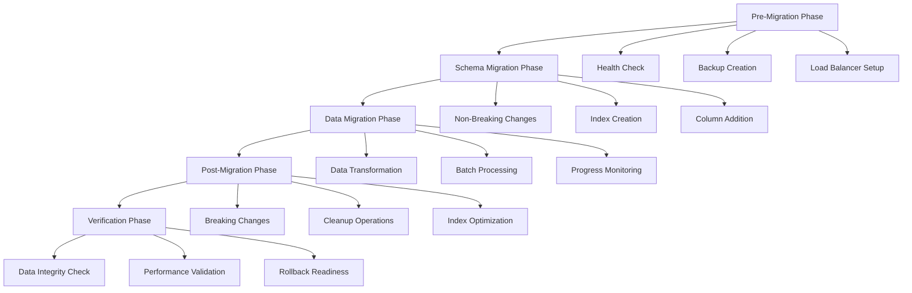

# StockRx マイグレーション・データパッチ設計書

## 1. 概要と設計方針

### 1.1 メタ認知的分析

**Before（現状の課題）**:
- マイグレーションの可逆性が部分的にしか実装されていない
- リリース時の負荷対策が十分でない
- データパッチとスキーマ変更の管理が分離されていない
- ゼロダウンタイムデプロイメントへの対応が不完全

**After（改善目標）**:
- 完全可逆性を持つマイグレーション体系の確立
- リリース時負荷を最小化する段階的デプロイメント戦略
- データパッチとスキーマ変更の統合管理
- ゼロダウンタイムデプロイメントの実現

### 1.2 設計原則

1. **可逆性の保証**: すべてのマイグレーションは安全にロールバック可能
2. **負荷分散**: リリース時の負荷を時間的・空間的に分散
3. **段階的実行**: 大きな変更を小さなステップに分割
4. **監視可能性**: 各ステップの進行状況と健全性を監視
5. **自動化**: 手動操作によるミスを最小化

## 2. 現状分析

### 2.1 既存マイグレーションの分析

```ruby
# 現状のマイグレーション例
class CreateAdminNotificationSettings < ActiveRecord::Migration[7.2]
  def change
    create_table :admin_notification_settings do |t|
      # ... テーブル定義
    end
    
    # 可逆性を持つ初期データ挿入
    reversible do |dir|
      dir.up do
        Admin.find_each do |admin|
          AdminNotificationSetting.create_default_settings_for(admin)
        end
      end
      # dir.down は未実装 → 改善が必要
    end
  end
end
```

**問題点**:
- `dir.down` でのクリーンアップ処理が未実装
- 大量データ処理時の負荷対策が不足
- エラー処理とロールバック戦略が不完全

### 2.2 データパッチの現状

```ruby
# 現在のデータポータビリティ機能
module DataPortable
  # エクスポート/インポート機能は実装済み
  # しかし、マイグレーション時のデータパッチとの統合が不十分
end
```

## 3. 設計アーキテクチャ

### 3.1 マイグレーション階層設計

```ruby
# lib/migration_framework/
module MigrationFramework
  class ReversibleMigration < ActiveRecord::Migration[8.0]
    # 基底クラス - 完全可逆性を保証
  end
  
  class DataPatchMigration < ReversibleMigration
    # データパッチ専用マイグレーション
  end
  
  class SchemaMigration < ReversibleMigration
    # スキーマ変更専用マイグレーション
  end
  
  class ZeroDowntimeMigration < ReversibleMigration
    # ゼロダウンタイム対応マイグレーション
  end
end
```

### 3.2 実行フェーズ設計



## 4. 具体的実装

### 4.1 可逆的マイグレーション基底クラス

```ruby
# lib/migration_framework/reversible_migration.rb
module MigrationFramework
  class ReversibleMigration < ActiveRecord::Migration[8.0]
    class_attribute :migration_metadata
    
    def initialize(name = nil, version = nil)
      super
      @rollback_data = {}
      @progress_tracker = ProgressTracker.new(self.class.name)
    end
    
    # 可逆性を強制するラッパー
    def reversible_change(&block)
      reversible do |dir|
        dir.up do
          execute_with_progress(:up, &block)
        end
        
        dir.down do
          execute_rollback
        end
      end
    end
    
    private
    
    def execute_with_progress(direction, &block)
      @progress_tracker.start(direction)
      
      begin
        instance_eval(&block)
        @progress_tracker.complete
      rescue => e
        @progress_tracker.error(e)
        prepare_rollback_data if direction == :up
        raise
      end
    end
    
    def execute_rollback
      return unless @rollback_data.any?
      
      @rollback_data.reverse_each do |operation, data|
        case operation
        when :created_records
          delete_created_records(data)
        when :modified_records
          restore_modified_records(data)
        when :deleted_records
          restore_deleted_records(data)
        end
      end
    end
    
    def record_operation(operation, data)
      @rollback_data[operation] ||= []
      @rollback_data[operation] << data
    end
    
    def delete_created_records(records)
      records.each do |model_class, ids|
        model_class.where(id: ids).delete_all
      end
    end
    
    def restore_modified_records(records)
      records.each do |model_class, data|
        data.each do |id, attributes|
          model_class.where(id: id).update_all(attributes)
        end
      end
    end
    
    def restore_deleted_records(records)
      records.each do |model_class, data|
        model_class.insert_all(data)
      end
    end
  end
end
```

### 4.2 ゼロダウンタイムマイグレーション

```ruby
# lib/migration_framework/zero_downtime_migration.rb
module MigrationFramework
  class ZeroDowntimeMigration < ReversibleMigration
    # フェーズ1: 非破壊的変更
    def phase1_prepare
      # 新しいカラムやテーブルの追加（NULL許可）
      # インデックスの並行作成
      # トリガーの設定
    end
    
    # フェーズ2: データ移行
    def phase2_migrate_data
      # バッチ処理でのデータ移行
      # 進行状況の監視
      # パフォーマンス制御
    end
    
    # フェーズ3: 切り替え
    def phase3_switch
      # アプリケーションコードのデプロイ
      # 設定の切り替え
      # 古いカラムの非推奨化
    end
    
    # フェーズ4: クリーンアップ
    def phase4_cleanup
      # 古いカラムやインデックスの削除
      # トリガーの削除
      # 最適化
    end
    
    def change
      case migration_phase
      when 1
        phase1_prepare
      when 2
        phase2_migrate_data
      when 3
        phase3_switch
      when 4
        phase4_cleanup
      end
    end
    
    private
    
    def migration_phase
      ENV.fetch('MIGRATION_PHASE', '1').to_i
    end
  end
end
```

### 4.3 負荷制御マイグレーション

```ruby
# lib/migration_framework/load_controlled_migration.rb
module MigrationFramework
  class LoadControlledMigration < ReversibleMigration
    DEFAULT_BATCH_SIZE = 1000
    DEFAULT_SLEEP_INTERVAL = 0.1
    
    def batch_process(collection, batch_size: DEFAULT_BATCH_SIZE, &block)
      total_count = collection.count
      processed = 0
      
      collection.find_in_batches(batch_size: batch_size) do |batch|
        ActiveRecord::Base.transaction do
          yield(batch)
        end
        
        processed += batch.size
        update_progress(processed, total_count)
        
        # 負荷制御のための休止
        sleep(calculate_sleep_time)
        
        # リソース監視と動的調整
        adjust_batch_size_if_needed
      end
    end
    
    private
    
    def calculate_sleep_time
      # 現在の負荷に基づいて動的調整
      case current_system_load
      when 0..0.5
        0.05  # 低負荷時は高速処理
      when 0.5..0.8
        DEFAULT_SLEEP_INTERVAL
      else
        0.5   # 高負荷時は長い休止
      end
    end
    
    def current_system_load
      # システムリソースの監視
      cpu_usage = `top -l 1 -n 0 | grep "CPU usage"`.match(/(\d+\.\d+)%/)[1].to_f / 100
      memory_usage = get_memory_usage_percentage
      
      [cpu_usage, memory_usage].max
    end
    
    def adjust_batch_size_if_needed
      if current_system_load > 0.8
        @current_batch_size = [@current_batch_size * 0.8, 100].max.to_i
      elsif current_system_load < 0.3
        @current_batch_size = [@current_batch_size * 1.2, 5000].min.to_i
      end
    end
    
    def update_progress(processed, total)
      progress = (processed.to_f / total * 100).round(2)
      Rails.logger.info("Migration progress: #{processed}/#{total} (#{progress}%)")
      
      # ActionCableで進行状況を通知
      ActionCable.server.broadcast(
        "migration_progress",
        {
          migration: self.class.name,
          progress: progress,
          processed: processed,
          total: total,
          timestamp: Time.current
        }
      )
    end
  end
end
```

### 4.4 データパッチマイグレーション

```ruby
# lib/migration_framework/data_patch_migration.rb
module MigrationFramework
  class DataPatchMigration < LoadControlledMigration
    def apply_data_patch(model_class, conditions = {}, &transformer)
      records_to_patch = model_class.where(conditions)
      
      batch_process(records_to_patch) do |batch|
        batch.each do |record|
          original_attributes = record.attributes.dup
          
          # 変更前の状態を記録（ロールバック用）
          record_operation(:modified_records, {
            model_class => { record.id => original_attributes }
          })
          
          # データ変換の実行
          transformed_record = yield(record)
          
          if transformed_record.changed?
            transformed_record.save!
          end
        end
      end
    end
    
    def create_records(model_class, records_data)
      created_ids = []
      
      records_data.each_slice(DEFAULT_BATCH_SIZE) do |batch|
        created_records = model_class.insert_all(
          batch,
          returning: [:id]
        )
        
        created_ids.concat(created_records.pluck(:id))
      end
      
      # ロールバック用にIDを記録
      record_operation(:created_records, {
        model_class => created_ids
      })
    end
    
    def delete_records(model_class, conditions)
      records_to_delete = model_class.where(conditions)
      deleted_data = records_to_delete.pluck(:id, :*)
      
      # ロールバック用にデータを保存
      record_operation(:deleted_records, {
        model_class => deleted_data.map { |row| 
          model_class.column_names.zip(row).to_h 
        }
      })
      
      records_to_delete.delete_all
    end
  end
end
```

### 4.5 マイグレーション管理タスク

```ruby
# lib/tasks/migration_management.rake
namespace :migration do
  desc "マイグレーションの可逆性チェック"
  task check_reversibility: :environment do
    puts "=== マイグレーション可逆性チェック ==="
    
    migration_files = Dir[Rails.root.join("db/migrate/*.rb")]
    
    migration_files.each do |file|
      migration_content = File.read(file)
      
      unless has_reversible_implementation?(migration_content)
        puts "⚠️  #{File.basename(file)}: 可逆性の実装が不完全"
      end
    end
  end
  
  desc "段階的マイグレーション実行"
  task :execute_phased, [:phase] => :environment do |task, args|
    phase = args[:phase].to_i
    
    puts "=== フェーズ #{phase} マイグレーション実行 ==="
    
    ENV['MIGRATION_PHASE'] = phase.to_s
    
    # バックアップの作成
    Rake::Task['backup:create'].invoke if phase == 1
    
    # マイグレーション実行
    Rake::Task['db:migrate'].invoke
    
    # 検証
    Rake::Task['migration:verify'].invoke
  end
  
  desc "マイグレーション検証"
  task verify: :environment do
    puts "=== マイグレーション結果検証 ==="
    
    # データ整合性チェック
    verify_data_integrity
    
    # パフォーマンステスト
    verify_performance
    
    # ロールバック準備確認
    verify_rollback_readiness
  end
  
  desc "安全なロールバック実行"
  task :safe_rollback, [:steps] => :environment do |task, args|
    steps = args[:steps]&.to_i || 1
    
    puts "=== 安全なロールバック実行 (#{steps} ステップ) ==="
    
    # ロールバック前の検証
    unless rollback_safe?
      puts "❌ ロールバックが安全でありません"
      exit 1
    end
    
    # バックアップ作成
    Rake::Task['backup:create'].invoke
    
    # ロールバック実行
    ActiveRecord::Migrator.run(:down, ActiveRecord::Base.connection.migration_context.migrations_paths, steps)
    
    # ロールバック後の検証
    verify_rollback_success
  end
  
  private
  
  def has_reversible_implementation?(content)
    # reversible ブロックまたは up/down メソッドの存在確認
    content.include?('reversible') || 
    (content.include?('def up') && content.include?('def down'))
  end
  
  def verify_data_integrity
    # 外部キー制約の確認
    # レコード数の整合性確認
    # 必須フィールドの確認
  end
  
  def verify_performance
    # 主要クエリのパフォーマンステスト
    # インデックスの効果確認
    # メモリ使用量チェック
  end
  
  def verify_rollback_readiness
    # ロールバックデータの存在確認
    # 依存関係の確認
    # バックアップの妥当性確認
  end
  
  def rollback_safe?
    # アクティブなトランザクションがないか
    # 他のマイグレーションが実行中でないか
    # 十分なディスク容量があるか
    true
  end
  
  def verify_rollback_success
    # データ整合性の再確認
    # アプリケーションの動作確認
    # パフォーマンステスト
  end
end
```

### 4.6 リリース時負荷制御

```ruby
# lib/tasks/deployment.rake
namespace :deployment do
  desc "ゼロダウンタイムデプロイメント"
  task zero_downtime: :environment do
    puts "=== ゼロダウンタイムデプロイメント開始 ==="
    
    # フェーズ1: 準備
    execute_phase("準備フェーズ") do
      Rake::Task['deployment:prepare'].invoke
    end
    
    # フェーズ2: スキーマ変更
    execute_phase("スキーマ変更フェーズ") do
      ENV['MIGRATION_PHASE'] = '1'
      Rake::Task['db:migrate'].invoke
    end
    
    # フェーズ3: アプリケーションデプロイ
    execute_phase("アプリケーションデプロイフェーズ") do
      Rake::Task['deployment:app_deploy'].invoke
    end
    
    # フェーズ4: データ移行
    execute_phase("データ移行フェーズ") do
      ENV['MIGRATION_PHASE'] = '2'
      Rake::Task['db:migrate'].invoke
    end
    
    # フェーズ5: 最終切り替え
    execute_phase("最終切り替えフェーズ") do
      ENV['MIGRATION_PHASE'] = '3'
      Rake::Task['db:migrate'].invoke
    end
    
    # フェーズ6: クリーンアップ
    execute_phase("クリーンアップフェーズ") do
      ENV['MIGRATION_PHASE'] = '4'
      Rake::Task['db:migrate'].invoke
    end
    
    puts "✅ ゼロダウンタイムデプロイメント完了"
  end
  
  desc "デプロイメント準備"
  task prepare: :environment do
    # ヘルスチェック
    perform_health_check
    
    # バックアップ作成
    Rake::Task['backup:create'].invoke
    
    # ロードバランサー設定
    configure_load_balancer
    
    # メンテナンスモード準備
    prepare_maintenance_mode
  end
  
  desc "アプリケーションデプロイ"
  task app_deploy: :environment do
    # Blue-Green デプロイメント
    # または カナリアリリース
    deploy_application_code
  end
  
  private
  
  def execute_phase(phase_name)
    puts "--- #{phase_name} 開始 ---"
    start_time = Time.current
    
    begin
      yield
      duration = Time.current - start_time
      puts "✅ #{phase_name} 完了 (#{duration.round(2)}秒)"
    rescue => e
      puts "❌ #{phase_name} 失敗: #{e.message}"
      handle_deployment_failure(phase_name, e)
      raise
    end
  end
  
  def perform_health_check
    # データベース接続確認
    # Redis接続確認
    # 外部サービス接続確認
    # ディスク容量確認
  end
  
  def configure_load_balancer
    # トラフィック制御設定
    # ヘルスチェック設定更新
    # 段階的切り替え準備
  end
  
  def prepare_maintenance_mode
    # メンテナンス画面準備
    # 通知システム準備
    # 緊急時ロールバック準備
  end
  
  def deploy_application_code
    # アプリケーションコードのデプロイ
    # 設定ファイルの更新
    # サービス再起動
  end
  
  def handle_deployment_failure(phase, error)
    # エラーログ記録
    # アラート送信
    # 自動ロールバック検討
    # 運用チーム通知
  end
end
```

## 5. 監視とアラート

### 5.1 マイグレーション監視システム

```ruby
# app/models/migration_monitor.rb
class MigrationMonitor
  include Singleton
  
  def initialize
    @active_migrations = {}
    @performance_metrics = {}
  end
  
  def start_monitoring(migration_name)
    @active_migrations[migration_name] = {
      started_at: Time.current,
      phase: :starting,
      progress: 0,
      estimated_completion: nil
    }
    
    broadcast_status(migration_name)
  end
  
  def update_progress(migration_name, progress, phase = nil)
    return unless @active_migrations[migration_name]
    
    @active_migrations[migration_name].merge!({
      progress: progress,
      phase: phase || @active_migrations[migration_name][:phase],
      updated_at: Time.current,
      estimated_completion: calculate_estimated_completion(migration_name, progress)
    })
    
    broadcast_status(migration_name)
    check_performance_thresholds(migration_name)
  end
  
  def complete_migration(migration_name, success: true)
    return unless @active_migrations[migration_name]
    
    migration_data = @active_migrations.delete(migration_name)
    duration = Time.current - migration_data[:started_at]
    
    log_migration_completion(migration_name, duration, success)
    broadcast_completion(migration_name, success, duration)
  end
  
  private
  
  def calculate_estimated_completion(migration_name, progress)
    return nil if progress <= 0
    
    migration_data = @active_migrations[migration_name]
    elapsed_time = Time.current - migration_data[:started_at]
    estimated_total_time = elapsed_time / (progress / 100.0)
    
    migration_data[:started_at] + estimated_total_time
  end
  
  def broadcast_status(migration_name)
    ActionCable.server.broadcast(
      "migration_status",
      {
        migration: migration_name,
        status: @active_migrations[migration_name],
        timestamp: Time.current
      }
    )
  end
  
  def check_performance_thresholds(migration_name)
    migration_data = @active_migrations[migration_name]
    duration = Time.current - migration_data[:started_at]
    
    # 警告しきい値チェック
    if duration > 30.minutes && migration_data[:progress] < 50
      send_alert(:slow_migration, migration_name, duration)
    end
    
    # 危険しきい値チェック
    if duration > 1.hour && migration_data[:progress] < 80
      send_alert(:critical_migration, migration_name, duration)
    end
  end
  
  def send_alert(level, migration_name, duration)
    AlertService.send_alert(
      level: level,
      title: "マイグレーション性能警告",
      message: "#{migration_name} が #{duration.to_i}秒実行されています",
      details: @active_migrations[migration_name]
    )
  end
  
  def log_migration_completion(migration_name, duration, success)
    Rails.logger.info({
      event: "migration_completed",
      migration: migration_name,
      duration_seconds: duration,
      success: success,
      timestamp: Time.current
    }.to_json)
  end
  
  def broadcast_completion(migration_name, success, duration)
    ActionCable.server.broadcast(
      "migration_completion",
      {
        migration: migration_name,
        success: success,
        duration: duration,
        timestamp: Time.current
      }
    )
  end
end
```

### 5.2 アラートサービス

```ruby
# app/services/alert_service.rb
class AlertService
  ALERT_CHANNELS = {
    email: EmailAlertChannel,
    slack: SlackAlertChannel,
    actioncable: ActionCableAlertChannel
  }.freeze
  
  def self.send_alert(level:, title:, message:, details: {})
    alert = {
      level: level,
      title: title,
      message: message,
      details: details,
      timestamp: Time.current
    }
    
    # レベルに応じてチャンネルを選択
    channels = channels_for_level(level)
    
    channels.each do |channel_class|
      begin
        channel_class.send_alert(alert)
      rescue => e
        Rails.logger.error("Alert delivery failed: #{e.message}")
      end
    end
  end
  
  private
  
  def self.channels_for_level(level)
    case level
    when :info
      [ActionCableAlertChannel]
    when :warning
      [ActionCableAlertChannel, EmailAlertChannel]
    when :critical, :slow_migration, :critical_migration
      [ActionCableAlertChannel, EmailAlertChannel, SlackAlertChannel]
    else
      [ActionCableAlertChannel]
    end
  end
end
```

## 6. テスト戦略

### 6.1 マイグレーションテスト

```ruby
# spec/lib/migration_framework/reversible_migration_spec.rb
RSpec.describe MigrationFramework::ReversibleMigration do
  let(:test_migration) do
    Class.new(described_class) do
      def change
        reversible_change do
          create_table :test_migration_table do |t|
            t.string :name
            t.timestamps
          end
        end
      end
    end
  end
  
  describe "可逆性テスト" do
    it "マイグレーション実行後にロールバックできる" do
      # マイグレーション実行
      test_migration.new.migrate(:up)
      expect(ActiveRecord::Base.connection.table_exists?(:test_migration_table)).to be true
      
      # ロールバック実行
      test_migration.new.migrate(:down)
      expect(ActiveRecord::Base.connection.table_exists?(:test_migration_table)).to be false
    end
  end
  
  describe "進行状況監視" do
    it "進行状況が正しく追跡される" do
      expect(MigrationMonitor.instance).to receive(:start_monitoring)
      expect(MigrationMonitor.instance).to receive(:update_progress)
      expect(MigrationMonitor.instance).to receive(:complete_migration)
      
      test_migration.new.migrate(:up)
    end
  end
end
```

### 6.2 負荷テスト

```ruby
# spec/performance/migration_load_test_spec.rb
RSpec.describe "マイグレーション負荷テスト", type: :performance do
  describe "大量データでのマイグレーション" do
    before do
      # 10万件のテストデータを作成
      create_list(:inventory, 100_000)
    end
    
    it "制限時間内にマイグレーションが完了する" do
      start_time = Time.current
      
      # テスト用マイグレーション実行
      TestDataMigration.new.migrate(:up)
      
      duration = Time.current - start_time
      expect(duration).to be < 30.minutes
    end
    
    it "システムリソースの使用量が制限内である" do
      resource_monitor = ResourceMonitor.new
      resource_monitor.start
      
      TestDataMigration.new.migrate(:up)
      
      metrics = resource_monitor.stop
      expect(metrics[:max_memory_usage]).to be < 2.gigabytes
      expect(metrics[:max_cpu_usage]).to be < 80 # 80%
    end
  end
end
```

## 7. 運用ガイドライン

### 7.1 デプロイメント手順

1. **事前準備**
   - ヘルスチェック実行
   - バックアップ作成
   - ロードバランサー設定

2. **段階的実行**
   - フェーズ1: 非破壊的スキーマ変更
   - フェーズ2: アプリケーションデプロイ
   - フェーズ3: データ移行
   - フェーズ4: 破壊的変更とクリーンアップ

3. **監視と検証**
   - 各フェーズでの健全性確認
   - パフォーマンス監視
   - エラー率監視

4. **ロールバック準備**
   - ロールバック可能性の確認
   - 緊急時対応手順の準備

### 7.2 緊急時対応

```ruby
# lib/tasks/emergency_response.rake
namespace :emergency do
  desc "緊急ロールバック実行"
  task rollback: :environment do
    puts "🚨 緊急ロールバック開始"
    
    # 1. トラフィック停止
    stop_incoming_traffic
    
    # 2. 現在実行中のマイグレーションを停止
    stop_active_migrations
    
    # 3. データベースロールバック
    Rake::Task['migration:safe_rollback'].invoke
    
    # 4. アプリケーションロールバック
    rollback_application_code
    
    # 5. サービス再開
    resume_traffic
    
    puts "✅ 緊急ロールバック完了"
  end
  
  desc "システム状態確認"
  task health_check: :environment do
    puts "=== システム健全性確認 ==="
    
    checks = [
      { name: "データベース接続", check: -> { check_database_connection } },
      { name: "Redis接続", check: -> { check_redis_connection } },
      { name: "ディスク容量", check: -> { check_disk_space } },
      { name: "メモリ使用量", check: -> { check_memory_usage } },
      { name: "CPU使用率", check: -> { check_cpu_usage } }
    ]
    
    checks.each do |check|
      result = check[:check].call
      status = result ? "✅" : "❌"
      puts "#{status} #{check[:name]}"
    end
  end
end
```

## 8. 今後の拡張計画

### 8.1 短期目標（1-3ヶ月）

- [ ] 基本的な可逆マイグレーション框架の実装
- [ ] 既存マイグレーションの可逆性強化
- [ ] 負荷制御機能の実装
- [ ] 監視システムの構築

### 8.2 中期目標（3-6ヶ月）

- [ ] ゼロダウンタイムデプロイメントの完全実装
- [ ] 自動ロールバック機能
- [ ] 高度な監視とアラート
- [ ] パフォーマンス最適化

### 8.3 長期目標（6-12ヶ月）

- [ ] 機械学習による最適化提案
- [ ] クロスリージョンマイグレーション
- [ ] 災害復旧自動化
- [ ] コンプライアンス対応強化

## 9. メトリクスとKPI

### 9.1 成功指標

- **可逆性**: 100%のマイグレーションがロールバック可能
- **デプロイ時間**: 50%削減（現状30分 → 目標15分）
- **ダウンタイム**: ゼロダウンタイムの実現
- **エラー率**: マイグレーション失敗率 < 1%

### 9.2 監視指標

- マイグレーション実行時間
- リソース使用量（CPU、メモリ、ディスク）
- エラー発生率
- ロールバック実行回数

## 10. 結論

本設計により、StockRxアプリケーションは以下を実現します：

1. **完全な可逆性**: すべてのマイグレーションが安全にロールバック可能
2. **負荷制御**: リリース時の負荷を最小化し、システム安定性を確保
3. **ゼロダウンタイム**: サービス中断なしでのデプロイメント
4. **包括的監視**: リアルタイムでの進行状況とシステム健全性の監視
5. **自動化**: 人的ミスを最小化し、確実な運用を実現

この設計は段階的に実装され、各フェーズで検証とフィードバックを行いながら継続的に改善されます。 