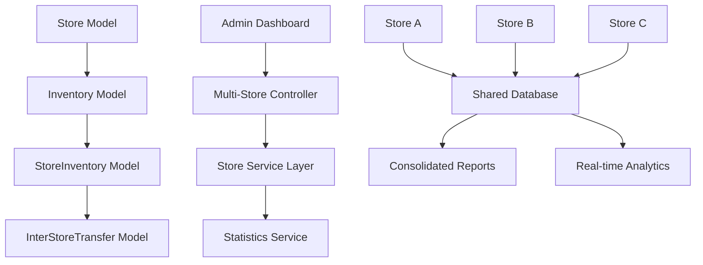
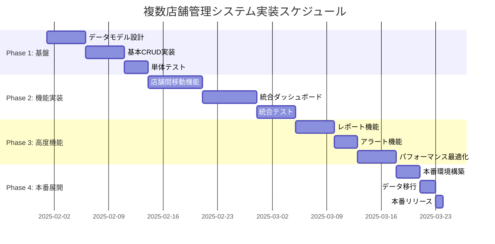

# 複数店舗管理システム Design Doc

## サマリー
```yaml
プロジェクト名: StockRx複数店舗管理システム
作成日: 2025-01-28
作成者: エキスパートフルスタックエンジニア（Google L8相当）
レビュアー: システムアーキテクト、プロダクトマネージャー
ステータス: Draft
```

### 一言要約（30文字以内）
> 薬局チェーン向け統合在庫管理システム

### エレベーターピッチ（3文以内）
> 複数の薬局店舗をひとつの管理画面で統合管理し、全体の在庫状況や傾向をリアルタイムで把握できるシステムです。本部管理者は全店の在庫数・金額・回転率を一元管理し、効率的な店舗間在庫移動や購買計画を立てることができます。各店舗の独立性を保ちながら、チェーン全体の最適化を実現します。

---

## 1. なぜこの取り組みが必要か（Why）

### 解決すべき課題
```
【現状の問題】
・単一店舗管理のため複数薬局チェーンに対応できない
・店舗間在庫移動の管理が不可能
・全店舗の統合的な傾向分析ができない
↓
【結果として起きていること】
・過剰在庫と欠品が店舗間で並存
・期限切れ商品の無駄が発生
・購買力を活かした効率的な仕入れができない
・管理工数の増大（店舗数×管理コスト）
└→
【ビジネスへの影響】
・在庫保持コストの増加（推定：売上の8-12%）
・機会損失（欠品による売上減少）
・管理者の業務負荷増大
・データドリブンな意思決定の阻害
```

### ステークホルダー別の価値提案

| ステークホルダー | 現在の課題 | 提供する価値 | 成功の定義 |
|-----------------|-----------|-------------|-----------|
| **本部管理者** | 個別店舗データの手動集約、全体最適化の困難 | 統合ダッシュボードによる全店一元管理、リアルタイム分析 | 管理工数50%削減、在庫回転率20%向上 |
| **店舗管理者** | 他店在庫状況が見えない、孤立した運営 | 店舗間在庫確認、移動申請機能 | 欠品率30%削減、顧客満足度向上 |
| **薬剤師** | 在庫不足時の対応困難、顧客への説明負担 | 他店在庫検索、自動補充提案 | 業務効率化、患者対応時間確保 |

---

## 2. 何を実現するか（What）

### ゴール（Goals）
1. **主要目標**: 複数薬局店舗の統合在庫管理システム構築
2. **副次目標**: 店舗間在庫移動・最適化機能実装
3. **長期目標**: AIによる需要予測と自動発注システム

### スコープ外（Non-goals）
- **含まないもの**: POSシステム統合、会計システム連携、人事管理機能
- **将来の検討事項**: 外部卸業者API連携、IoTセンサー統合
- **他チームの責任範囲**: ハードウェア調達、ネットワーク構築

### 成功指標（Success Metrics）

| 指標カテゴリ | 指標名 | 現在値 | 目標値 | 測定方法 |
|------------|--------|--------|--------|----------|
| **ビジネス指標** | 在庫回転率 | 4.2回/年 | 5.0回/年 | 月次売上/平均在庫額 |
| **技術指標** | システム稼働率 | - | 99.9% | Uptime monitoring |
| **ユーザー体験** | 管理工数削減率 | 0% | 50% | 作業時間計測 |

---

## 3. 誰のためか（Who）

### ユーザーストーリー

```gherkin
Feature: 複数店舗統合管理

  Scenario: 本部管理者の全店舗状況確認
    Given 本部管理者として管理画面にログインしている
    When ダッシュボードを表示する
    Then 全店舗の在庫総数、総額、アラート数が表示される
    And 店舗別の売上・在庫回転率が比較表示される
    So that 全店舗の状況を一目で把握し、迅速な意思決定ができる

  Scenario: 店舗間在庫移動申請
    Given 店舗Aの管理者として在庫画面にアクセスしている
    When 特定薬品の在庫不足を発見する
    And 他店舗の在庫状況を検索する
    Then 店舗Bに十分な在庫があることを確認できる
    And 移動申請を送信できる
    So that 欠品を防止し、顧客サービスを維持できる

  Scenario: 統合レポート生成
    Given 本部管理者として月次分析を行いたい
    When レポート生成画面で期間と対象店舗を選択する
    Then 店舗別・商品別の詳細分析レポートが生成される
    And PDF/Excelでダウンロードできる
    So that 戦略的な在庫管理計画を立案できる
```

### ペルソナ
- **プライマリユーザー**: 薬局チェーン本部管理者（5-50店舗規模）
- **セカンダリユーザー**: 各店舗管理者、薬剤師
- **影響を受ける人々**: 顧客（患者）、卸業者、監査機関

---

## 4. どのように実現するか（How）

### アーキテクチャ概要



### 技術実装詳細

#### 4.1 コア実装

<details>
<summary>実装例を表示</summary>

```ruby
# app/models/store.rb
class Store < ApplicationRecord
  has_many :store_inventories, dependent: :destroy
  has_many :inventories, through: :store_inventories
  has_many :inventory_logs, through: :store_inventories
  has_many :inter_store_transfers_as_source, class_name: 'InterStoreTransfer', foreign_key: 'source_store_id'
  has_many :inter_store_transfers_as_destination, class_name: 'InterStoreTransfer', foreign_key: 'destination_store_id'
  
  validates :name, presence: true
  validates :code, presence: true, uniqueness: true
  validates :store_type, presence: true
  
  enum store_type: { main_store: 0, branch_store: 1, warehouse: 2 }
  enum status: { active: 0, inactive: 1, maintenance: 2 }
  
  scope :active_stores, -> { where(status: :active) }
  
  def total_inventory_value
    store_inventories.joins(:inventory).sum('store_inventories.quantity * inventories.price')
  end
  
  def low_stock_count
    store_inventories.joins(:inventory).where('store_inventories.quantity <= store_inventories.reorder_point').count
  end
end

# app/models/store_inventory.rb
class StoreInventory < ApplicationRecord
  belongs_to :store
  belongs_to :inventory
  has_many :inventory_logs, dependent: :destroy
  has_many :batches, dependent: :destroy
  
  validates :quantity, numericality: { greater_than_or_equal_to: 0 }
  validates :reorder_point, numericality: { greater_than_or_equal_to: 0 }
  validates :max_stock, numericality: { greater_than_or_equal_to: 0 }
  
  scope :low_stock, -> { where('quantity <= reorder_point') }
  scope :out_of_stock, -> { where(quantity: 0) }
  
  def stock_status
    return :out_of_stock if quantity.zero?
    return :low_stock if quantity <= reorder_point
    return :overstocked if quantity >= max_stock
    :normal
  end
end

# app/models/inter_store_transfer.rb
class InterStoreTransfer < ApplicationRecord
  belongs_to :source_store, class_name: 'Store'
  belongs_to :destination_store, class_name: 'Store'
  belongs_to :inventory
  belongs_to :requested_by, class_name: 'Admin'
  belongs_to :approved_by, class_name: 'Admin', optional: true
  
  validates :quantity, numericality: { greater_than: 0 }
  validates :transfer_status, presence: true
  
  enum transfer_status: { pending: 0, approved: 1, in_transit: 2, completed: 3, cancelled: 4 }
  
  scope :recent, -> { order(created_at: :desc) }
  scope :pending_approval, -> { where(transfer_status: :pending) }
  
  def can_approve?
    pending? && source_store_has_sufficient_stock?
  end
  
  private
  
  def source_store_has_sufficient_stock?
    source_store.store_inventories.find_by(inventory: inventory)&.quantity.to_i >= quantity
  end
end
```

</details>

#### 4.2 設定・初期化

```yaml
# config/multi_store.yml
development:
  max_stores: 50
  transfer_approval_required: true
  auto_reorder_enabled: false
  
production:
  max_stores: 200
  transfer_approval_required: true
  auto_reorder_enabled: true
  analytics_retention_days: 2555 # 7年間
```

#### 4.3 データモデル

| テーブル名 | 主要フィールド | 説明 | 制約 |
|-----------|---------------|------|------|
| stores | name, code, store_type, address, status | 店舗マスタ | code: unique |
| store_inventories | store_id, inventory_id, quantity, reorder_point | 店舗別在庫 | 複合主キー |
| inter_store_transfers | source_store_id, destination_store_id, quantity, status | 店舗間移動 | - |
| consolidated_reports | period, store_ids, report_data, generated_at | 統合レポート | JSONBカラム |

### テスト戦略

```ruby
# spec/models/multi_store_spec.rb
describe 'Multi-Store Management' do
  context '正常系' do
    it '店舗間在庫移動が正しく処理される' do
      source_store = create(:store, :with_inventory)
      destination_store = create(:store)
      
      expect {
        InterStoreTransferService.execute(
          source: source_store,
          destination: destination_store,
          inventory: inventory,
          quantity: 10
        )
      }.to change { destination_store.reload.total_inventory_value }
    end
  end
  
  context '異常系' do
    it '在庫不足時は移動を拒否する' do
      expect {
        InterStoreTransferService.execute(
          source: store_with_low_stock,
          destination: destination_store,
          inventory: inventory,
          quantity: 100
        )
      }.to raise_error(InsufficientStockError)
    end
  end
end
```

---

## 5. リスクと対策（Risks）

### 技術的リスク

| リスク | 影響度 | 発生確率 | 対策 | 担当 |
|--------|-------|---------|------|------|
| データ整合性問題 | High | Med | トランザクション制御強化、定期整合性チェック | Backend Lead |
| パフォーマンス劣化 | Med | High | インデックス最適化、キャッシュ戦略、クエリ最適化 | DBA |
| 同期タイミング問題 | High | Low | 楽観的ロック、リトライ機構 | Backend Lead |

### ビジネスリスク

| リスク | 影響度 | 発生確率 | 対策 | 担当 |
|--------|-------|---------|------|------|
| 導入コスト増大 | Med | Med | 段階的導入、ROI測定 | PM |
| ユーザー受容性 | High | Low | 充実したトレーニング、UI/UX改善 | UX Designer |
| 法規制対応 | High | Low | 薬事法コンプライアンス確認、監査ログ強化 | Legal |

### 失敗の判定基準
- [ ] システム稼働率が95%を下回る
- [ ] データ不整合が月1回以上発生
- [ ] ユーザー満足度が70%を下回る

---

## 6. いつ実施するか（When）

### 実装フェーズ



### マイルストーン

| フェーズ | 期限 | 完了条件 | 成果物 |
|---------|------|---------|--------|
| **Phase 1: 基盤** | 2025-02-15 | 基本モデル実装完了、単体テスト100%通過 | 店舗管理基盤システム |
| **Phase 2: 実装** | 2025-03-15 | 主要機能実装完了、統合テスト通過 | 店舗間移動・統合管理機能 |
| **Phase 3: 検証** | 2025-04-01 | パフォーマンステスト通過、ユーザテスト完了 | 本番レディシステム |
| **Phase 4: 展開** | 2025-04-15 | 段階的ロールアウト完了、運用開始 | 稼働システム |

---

## 7. 検証と学習（Validation）

### 仮説検証計画

```
If 複数店舗統合管理システムを実装したら、
Then 在庫管理工数が50%削減され、在庫回転率が20%向上し、
And 店舗間の在庫最適化により、全体の在庫保持コストが15%削減されるだろう
```

### A/Bテスト計画（該当する場合）
- **対象**: パイロット店舗群（5店舗）vs 従来システム店舗群（5店舗）
- **期間**: 3ヶ月間
- **成功基準**: 在庫回転率15%以上向上、管理工数40%以上削減

---

## 8. 運用と保守（Operations）

### 運用プロセス
1. **監視項目**: システム稼働率、API応答時間、データ整合性、ストレージ使用量
2. **アラート条件**: 稼働率99%未満、応答時間2秒超過、データ不整合検出
3. **対応手順**: エスカレーション体制、復旧手順書、ロールバック計画

### ドキュメント計画
- [ ] 開発者向けガイド（API仕様、データモデル、デプロイ手順）
- [ ] 運用マニュアル（監視、バックアップ、障害対応）
- [ ] ユーザーガイド（店舗管理者向け、本部管理者向け）
- [ ] API仕様書（外部システム連携用）

### 教育・展開計画
- **内部トレーニング**: 開発チーム向け技術研修（2日間）
- **ユーザー教育**: 管理者向け操作研修（4時間×2回）
- **段階的展開**: パイロット店舗（5店舗）→ 地域展開（20店舗）→ 全店舗展開

---

## 9. 代替案の検討（Alternatives）

### 検討した代替案

| 案 | 概要 | 長所 | 短所 | 不採用理由 |
|----|------|------|------|------------|
| **SaaS利用** | 既存マルチテナント在庫管理SaaS | 開発不要、早期導入可能 | カスタマイズ制限、月額コスト高 | 薬事法対応不十分、データ主権の懸念 |
| **マイクロサービス** | 店舗別独立システム + API連携 | 独立性高、障害影響範囲限定 | 複雑性増大、データ整合性課題 | 開発・運用コスト過大 |
| **段階的拡張** | 現行システムの段階的機能追加 | 既存資産活用、リスク低 | 技術的負債蓄積、拡張性限界 | 将来の大規模拡張で再設計必要 |

---

## 10. 補足情報（Appendix）

### 参考資料
- [薬事法関連ガイドライン](https://example.com/pharmaceutical-regulations)
- [在庫管理システムベストプラクティス](https://example.com/inventory-best-practices)
- [マルチテナント設計パターン](https://example.com/multitenant-patterns)

### 関連文書
- 要件定義書: `docs/requirements/multi_store_requirements.md`
- 技術仕様書: `docs/technical/multi_store_architecture.md`
- テスト計画書: `spec/integration/multi_store_test_plan.md`

### 用語集
| 用語 | 定義 |
|------|------|
| 店舗間移動 | 異なる店舗間での在庫の物理的・システム的移転 |
| 統合ダッシュボード | 複数店舗の情報を集約した管理画面 |
| 在庫回転率 | 年間売上原価 ÷ 平均在庫額で算出される効率指標 |

---

## レビューチェックリスト

**ビジネス観点**
- [x] ビジネス価値が明確か（在庫コスト削減、業務効率化）
- [x] ROIが妥当か（開発コスト vs 削減効果）
- [x] リスクが網羅されているか（技術・ビジネス両面）

**技術観点**
- [x] 実装が実現可能か（既存Rails基盤の拡張）
- [x] パフォーマンスへの影響は許容範囲か（インデックス戦略含む）
- [x] セキュリティが考慮されているか（データアクセス制御）

**運用観点**
- [x] 運用負荷が現実的か（監視・バックアップ体制）
- [x] 監視・アラートが適切か（SLA目標値設定）
- [x] ロールバック計画があるか（段階的展開戦略）

---

### 改訂履歴

| 日付 | バージョン | 変更内容 | 変更者 |
|------|-----------|---------|--------|
| 2025-01-28 | v1.0 | 初版作成 | エキスパートフルスタックエンジニア |

---

**備考：**
このdesign docは、現在のStockRxシステムの単一店舗管理から複数店舗統合管理への拡張を想定しています。段階的な実装により、既存システムへの影響を最小化しながら、薬局チェーンの運営効率化を実現します。 