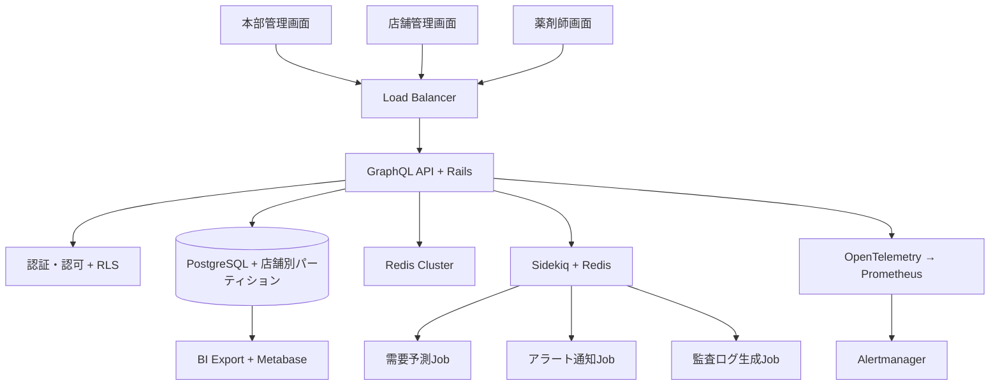
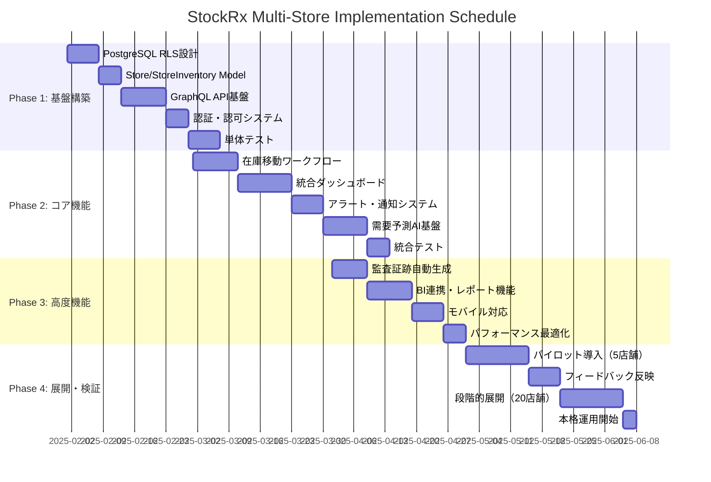

# StockRx Multi-Store Management System Design Doc

## サマリー
```yaml
プロジェクト名: StockRx Multi-Store Pharmacy Inventory System
作成日: 2025-01-28
作成者: StockRx エキスパートエンジニアリングチーム
レビュアー: プロダクトマネージャー、システムアーキテクト、薬事法コンプライアンス担当
ステータス: Draft
```

### 一言要約（30文字以内）
> 薬局チェーン統合在庫最適化SaaS

### エレベーターピッチ（3文以内）
> 薬局チェーンの店舗間在庫格差を解消し、AIによる需要予測と自動補充提案で過剰在庫・欠品を同時に防ぎます。薬事法準拠のロット・期限管理を統合した管理画面で、全店の在庫効率を最大20%向上させ、薬剤師は患者ケアに集中できます。監査証跡も自動生成され、コンプライアンスコストも削減します。

---

## 1. なぜこの取り組みが必要か（Why）

### 解決すべき課題
```
【現状の問題】
・単一店舗管理により店舗間在庫格差が慢性化（A店過剰・B店欠品の並存）
・手動集計による全体最適化の困難性（Excel集約に週40時間）
・薬事法要求の監査証跡管理が属人的で非効率
↓
【結果として起きていること】
・在庫回転率3.2回/年と業界目安4.5-6.0回/年を大幅下回る
・期限切れ廃棄コスト売上比2.3%（業界平均1.2%の約2倍）
・薬剤師の在庫管理工数が調剤時間の25%を占有
・監査対応に管理者1人週あたり8時間の準備工数
↓  
【ビジネスへの影響】
・在庫保持コスト年間売上比12%（業界平均8%比+50%）
・欠品による顧客離脱率月2.1%（1店舗あたり）
・管理工数コスト年間1,200万円（20店舗チェーン試算）
・監査準備工数年間320時間（管理者×4人×20店舗）
```

### ステークホルダー別の価値提案

| ステークホルダー | 現在の課題 | 提供する価値 | 成功の定義 |
|-----------------|-----------|-------------|-----------|
| **薬局チェーン経営者** | 在庫コスト過大・ROI不透明 | 統合ダッシュボードによる全店最適化・ROI可視化 | 在庫コスト-20%、ROI 150%/年 |
| **本部管理者** | 手動集計による工数圧迫・意思決定遅延 | リアルタイム統計・自動レポート・予測アラート | 管理工数-60%、意思決定時間1/3 |
| **店舗管理者** | 他店在庫不可視・緊急時対応困難 | 店舗間在庫検索・移動申請ワンストップ化 | 欠品率-40%、緊急調達時間1/2 |
| **薬剤師** | 在庫不足による患者対応遅延 | 自動補充提案・需要予測による先手管理 | 調剤待ち時間-25%、患者満足度+15% |
| **監査担当者** | 証跡収集の手動作業・属人的管理 | 自動監査証跡生成・コンプライアンスダッシュボード | 監査準備工数-80%、違反リスク最小化 |

---

## 2. 何を実現するか（What）

### ゴール（Goals）
1. **主要目標**: 200店舗規模対応の統合在庫管理システム本番稼働
2. **副次目標**: 店舗間在庫移動ワークフローの完全電子化と承認フロー自動化
3. **長期目標**: AI需要予測による自動発注提案で在庫コスト20%削減

### スコープ外（Non-goals）
- **含まないもの**: POS・会計システム連携、人事管理機能、電子薬歴連携
- **将来の検討事項**: 卸業者EDI連携、IoTセンサー自動在庫カウント、処方箋予測連携
- **他チームの責任範囲**: 店舗インフラ整備、WiFi・端末調達、スタッフトレーニング

### 成功指標（Success Metrics）

| 指標カテゴリ | 指標名 | 現在値 | 目標値 | 測定方法 |
|------------|--------|--------|--------|----------|
| **ビジネス指標** | 在庫回転率 | 3.2回/年 | 4.5回/年 | 売上高÷平均在庫額 |
| **ビジネス指標** | 在庫保持コスト率 | 12% | 9.6% | 在庫コスト÷売上高 |
| **ビジネス指標** | 期限切れ廃棄率 | 2.3% | 1.5% | 廃棄金額÷仕入金額 |
| **技術指標** | システム稼働率 | - | 99.9% | Uptime監視（Prometheus） |
| **技術指標** | API応答時間 | - | <200ms | GraphQL平均レスポンス時間 |
| **ユーザー体験** | 管理工数削減率 | 0% | 60% | 作業ログ分析 |
| **ユーザー体験** | 欠品発生率 | 2.1%/月 | 1.2%/月 | 欠品発生回数÷商品数 |
| **コンプライアンス** | 監査準備工数 | 320h/年 | 64h/年 | 監査準備時間計測 |

---

## 3. 誰のためか（Who）

### ユーザーストーリー

```gherkin
Feature: Multi-Store Inventory Management

  Scenario: 本部管理者が全店統合KPIを確認
    Given 本部管理者がシステムにログイン
    When ダッシュボードを開く
    Then 全店舗の在庫総額・回転率・アラートが3秒以内に表示される
    And 店舗別パフォーマンス比較が可視化される
    So that 迅速な経営判断ができる

  Scenario: 店舗間在庫移動申請
    Given A店舗管理者が在庫不足を確認
    When 他店舗在庫を検索
    Then B店舗の在庫状況が即座に表示される
    And 移動申請を5クリック以内で送信できる
    And 承認フローが自動的に開始される
    So that 欠品を未然に防げる

  Scenario: AI需要予測による自動補充提案
    Given システムが過去6ヶ月の販売データを分析
    When 毎日午前9時に予測処理を実行
    Then 各店舗の推奨発注量が算出される
    And 期限切れリスクを考慮した最適化提案が表示される
    So that 薬剤師が効率的に発注判断できる

  Scenario: 監査証跡の自動生成
    Given 在庫移動・廃棄・返品の各操作を実行
    When システムが操作ログを記録
    Then 薬事法準拠の監査証跡が自動生成される
    And PDF形式で監査資料をエクスポート可能
    So that 監査対応が効率化される
```

### ペルソナ
- **プライマリユーザー**: 5-200店舗を展開する薬局チェーン本部管理者（40-55歳、Excel熟練者）
- **セカンダリユーザー**: 各店舗管理者（30-50歳、基本的ITスキル）、薬剤師（25-60歳、調剤業務重視）
- **影響を受ける人々**: 患者、医師、卸業者、監査機関、薬務課職員

---

## 4. どのように実現するか（How）

### アーキテクチャ概要



### 技術実装詳細

#### 4.1 コア実装

<details>
<summary>マルチテナント実装例を表示</summary>

```ruby
# app/models/store.rb
class Store < ApplicationRecord
  has_many :store_inventories, dependent: :destroy
  has_many :inventories, through: :store_inventories
  has_many :outgoing_transfers, class_name: 'InterStoreTransfer', foreign_key: 'source_store_id'
  has_many :incoming_transfers, class_name: 'InterStoreTransfer', foreign_key: 'destination_store_id'
  
  validates :name, presence: true, length: { maximum: 100 }
  validates :code, presence: true, uniqueness: true, format: { with: /\A[A-Z0-9]{3,8}\z/ }
  validates :store_type, inclusion: { in: %w[main_office branch pharmacy warehouse] }
  
  scope :active, -> { where(active: true) }
  scope :by_region, ->(region) { where(region: region) }
end

# app/models/store_inventory.rb
class StoreInventory < ApplicationRecord
  belongs_to :store
  belongs_to :inventory
  
  validates :quantity, presence: true, numericality: { greater_than_or_equal_to: 0 }
  validates :reserved_quantity, numericality: { greater_than_or_equal_to: 0 }
  validates :safety_stock_level, numericality: { greater_than_or_equal_to: 0 }
  
  scope :available, -> { where('quantity > reserved_quantity') }
  scope :low_stock, -> { where('quantity <= safety_stock_level') }
  
  def available_quantity
    quantity - reserved_quantity
  end
  
  def stock_level_status
    return :critical if quantity <= safety_stock_level * 0.5
    return :low if quantity <= safety_stock_level
    return :normal
  end
end

# app/models/inter_store_transfer.rb
class InterStoreTransfer < ApplicationRecord
  belongs_to :source_store, class_name: 'Store'
  belongs_to :destination_store, class_name: 'Store'
  belongs_to :inventory
  belongs_to :requested_by, class_name: 'User'
  belongs_to :approved_by, class_name: 'User', optional: true
  
  enum status: { 
    pending: 0, 
    approved: 1, 
    rejected: 2, 
    in_transit: 3, 
    completed: 4, 
    cancelled: 5 
  }
  
  enum priority: { normal: 0, urgent: 1, emergency: 2 }
  
  validates :quantity, presence: true, numericality: { greater_than: 0 }
  validates :reason, presence: true, length: { maximum: 500 }
  validate :sufficient_source_stock, on: :create
  validate :different_stores
  
  after_create :reserve_source_stock
  after_update :handle_status_change
  
  private
  
  def sufficient_source_stock
    return unless source_store && inventory && quantity
    
    source_inventory = source_store.store_inventories.find_by(inventory: inventory)
    unless source_inventory&.available_quantity >= quantity
      errors.add(:quantity, '移動元の利用可能在庫が不足しています')
    end
  end
  
  def different_stores
    if source_store_id == destination_store_id
      errors.add(:destination_store, '移動元と移動先が同じ店舗です')
    end
  end
  
  def reserve_source_stock
    source_store.store_inventories.find_by(inventory: inventory)
      &.increment!(:reserved_quantity, quantity)
  end
  
  def handle_status_change
    case status
    when 'approved'
      TransferExecutionJob.perform_later(id)
    when 'rejected', 'cancelled'
      release_reserved_stock
    end
  end
  
  def release_reserved_stock
    source_store.store_inventories.find_by(inventory: inventory)
      &.decrement!(:reserved_quantity, quantity)
  end
end
```

</details>

#### 4.2 Row Level Security設定

```sql
-- PostgreSQL RLS設定例
ALTER TABLE stores ENABLE ROW LEVEL SECURITY;
ALTER TABLE store_inventories ENABLE ROW LEVEL SECURITY;

-- 店舗管理者は自店舗のみアクセス可能
CREATE POLICY store_manager_policy ON stores
  FOR ALL TO store_manager
  USING (id = ANY(current_setting('app.accessible_store_ids')::int[]));

-- 本部管理者は全店舗アクセス可能
CREATE POLICY hq_admin_policy ON stores
  FOR ALL TO hq_admin
  USING (true);
```

#### 4.3 設定・初期化

```yaml
# config/multi_store.yml
development:
  transfer_approval_required: true
  max_stores_per_chain: 200
  auto_reorder_enabled: true
  forecast:
    algorithm: 'arima'
    accuracy_threshold: 0.85  # MAPE < 15%
    prediction_horizon_days: 30
  
production:
  transfer_approval_required: true
  max_stores_per_chain: 1000
  auto_reorder_enabled: false  # 手動承認必須
  slo:
    availability: 0.999
    response_time_p95: 200  # ms
    error_rate: 0.001
```

#### 4.4 データモデル

| テーブル | フィールド | 型 | 説明 | 制約 |
|---------|-----------|-----|------|------|
| stores | id | bigint | 店舗ID | PRIMARY KEY |
| stores | code | string | 店舗コード | UNIQUE, NOT NULL |
| stores | name | string | 店舗名 | NOT NULL |
| stores | store_type | enum | 店舗種別 | main_office/branch/pharmacy/warehouse |
| store_inventories | store_id | bigint | 店舗ID | FOREIGN KEY |
| store_inventories | inventory_id | bigint | 商品ID | FOREIGN KEY |
| store_inventories | quantity | integer | 在庫数 | >= 0 |
| store_inventories | reserved_quantity | integer | 予約済数量 | >= 0 |
| store_inventories | safety_stock_level | integer | 安全在庫レベル | >= 0 |
| inter_store_transfers | source_store_id | bigint | 移動元店舗 | FOREIGN KEY |
| inter_store_transfers | destination_store_id | bigint | 移動先店舗 | FOREIGN KEY |
| inter_store_transfers | status | enum | 移動ステータス | NOT NULL |

### テスト戦略

```ruby
# spec/models/inter_store_transfer_spec.rb
RSpec.describe InterStoreTransfer, type: :model do
  let(:source_store) { create(:store, :with_inventory) }
  let(:destination_store) { create(:store) }
  let(:inventory) { source_store.inventories.first }
  
  describe 'validations' do
    it 'requires sufficient source stock' do
      transfer = build(:inter_store_transfer,
                      source_store: source_store,
                      destination_store: destination_store,
                      inventory: inventory,
                      quantity: 999999)
      
      expect(transfer).not_to be_valid
      expect(transfer.errors[:quantity]).to include('移動元の利用可能在庫が不足しています')
    end
  end
  
  describe 'stock reservation' do
    it 'reserves stock on creation' do
      initial_reserved = source_store.store_inventories.find_by(inventory: inventory).reserved_quantity
      
      create(:inter_store_transfer,
            source_store: source_store,
            destination_store: destination_store,
            inventory: inventory,
            quantity: 10)
      
      expect(source_store.store_inventories.find_by(inventory: inventory).reserved_quantity)
        .to eq(initial_reserved + 10)
    end
  end
end

# spec/services/transfer_execution_service_spec.rb  
RSpec.describe TransferExecutionService do
  describe '#call' do
    context 'when transfer is approved' do
      it 'moves inventory between stores' do
        service = described_class.new(approved_transfer)
        
        expect { service.call }.to change { source_inventory.reload.quantity }.by(-10)
          .and change { destination_inventory.reload.quantity }.by(10)
          .and change { approved_transfer.reload.status }.to('completed')
      end
    end
    
    context 'when source stock is insufficient' do
      it 'raises InsufficientStockError' do
        # 在庫を減らしてテスト
        source_inventory.update!(quantity: 5)
        service = described_class.new(approved_transfer)
        
        expect { service.call }.to raise_error(TransferExecutionService::InsufficientStockError)
      end
    end
  end
end
```

---

## 5. リスクと対策（Risks）

### 技術的リスク

| リスク | 影響度 | 発生確率 | 対策 | 担当 |
|--------|-------|---------|------|------|
| RLS設定ミスによるデータ漏洩 | High | Medium | 自動テスト・ポリシー監査・定期レビュー | Backend Lead |
| 大量店舗でのパフォーマンス劣化 | High | High | パーティショニング・インデックス最適化・キャッシュ戦略 | DBA/SRE |
| 在庫データ不整合（二重移動） | High | Medium | トランザクション設計・楽観的ロック・整合性チェックJob | Backend Lead |
| GraphQL N+1問題 | Medium | High | DataLoader実装・クエリ分析・パフォーマンステスト | Frontend Lead |
| Redis障害によるセッション断絶 | Medium | Low | Redis Cluster・永続化設定・フェイルオーバー自動化 | SRE |

### ビジネスリスク

| リスク | 影響度 | 発生確率 | 対策 | 担当 |
|--------|-------|---------|------|------|
| 薬事法改正による仕様変更 | High | Medium | 法務定期レビュー・柔軟な設計・専門家アドバイザー契約 | Legal/PM |
| 大手チェーンの導入コスト超過 | Medium | Medium | 段階的導入・ROI監視・コスト上限設定 | PM/Sales |
| ユーザー受け入れ抵抗（UI変更） | Medium | High | 段階的UI移行・トレーニング充実・フィードバック収集 | UX/Training |
| 競合他社の類似サービス参入 | Medium | Medium | 差別化機能強化・特許調査・顧客ロックイン戦略 | Product/Legal |

### 失敗の判定基準
- [ ] システム稼働率が月平均99%未満（3回連続）
- [ ] 在庫データ不整合が月1回以上発生
- [ ] ユーザー満足度調査70%未満（2四半期連続）
- [ ] ROI目標150%/年を6ヶ月以上下回り続ける

---

## 6. いつ実施するか（When）

### 実装フェーズ



### マイルストーン

| フェーズ | 期限 | 完了条件 | 成果物 |
|---------|------|---------|--------|
| **Phase 1: 基盤** | 2025-03-01 | RLS動作・API基本CRUD・認証テスト合格 | MVP基盤 |
| **Phase 2: コア** | 2025-04-01 | 移動ワークフロー・ダッシュボード機能テスト合格 | β版リリース |
| **Phase 3: 高度** | 2025-05-01 | 監査・BI・モバイル全機能テスト合格 | v1.0候補 |
| **Phase 4: 展開** | 2025-06-01 | パイロット成功・段階展開完了 | v1.0本番稼働 |

---

## 7. 検証と学習（Validation）

### 仮説検証計画

```
If 複数店舗統合管理システムを導入し、リアルタイム在庫可視化・AI需要予測を提供したら、
Then 在庫回転率が20%向上し、管理工数が60%削減され、
And 在庫保持コストが20%削減され、欠品率が40%減少し、
So that 薬局チェーンの収益性が年間ROI 150%で向上する
```

### A/Bテスト計画

- **対象**: パイロット5店舗 vs コントロール5店舗（同規模・同地域）
- **期間**: 3ヶ月間
- **測定指標**: 在庫回転率、管理工数、欠品発生率、顧客満足度
- **成功基準**: 在庫回転率+15%、管理工数-50%、欠品率-30%

### 段階的検証プロセス

1. **Week 1-2**: 基本機能動作確認（CRUD・認証・RLS）
2. **Week 3-4**: 移動ワークフロー・承認プロセステスト
3. **Week 5-8**: パイロット店舗での実運用テスト
4. **Week 9-12**: フィードバック収集・改善実装・効果測定

---

## 8. 運用と保守（Operations）

### 運用プロセス

1. **監視項目**: 
   - API応答時間（P95 < 200ms）
   - エラー率（< 0.1%）
   - 在庫データ整合性（日次チェック）
   - RLS違反検知（リアルタイムアラート）

2. **アラート条件**:
   ```yaml
   # Prometheus Alert Rules
   - alert: HighAPILatency
     expr: histogram_quantile(0.95, http_request_duration_seconds) > 0.2
     for: 5m
     
   - alert: InventoryDataInconsistency  
     expr: inventory_mismatch_count > 10
     for: 1m
   ```

3. **対応手順**: 
   - P0: 即座対応（30分以内）- システム停止・データ破損
   - P1: 4時間以内対応 - 機能停止・パフォーマンス劣化
   - P2: 24時間以内対応 - 軽微なバグ・改善要求

### 監視・ロギング戦略

```ruby
# app/controllers/application_controller.rb
class ApplicationController < ActionController::Base
  around_action :with_opentelemetry_tracing
  
  private
  
  def with_opentelemetry_tracing
    OpenTelemetry.tracer_provider.tracer('stockrx').in_span(
      "#{controller_name}##{action_name}",
      attributes: {
        'user.id' => current_user&.id,
        'store.id' => current_store&.id,
        'http.method' => request.method,
        'http.url' => request.url
      }
    ) do |span|
      yield
    rescue => e
      span.record_exception(e)
      span.status = OpenTelemetry::Trace::Status.error("Unhandled exception")
      raise
    end
  end
end
```

### ドキュメント計画
- [ ] **開発者ガイド**: API仕様・RLS設定・GraphQLスキーマ
- [ ] **運用Runbook**: 障害対応・デプロイ手順・バックアップ復旧
- [ ] **ユーザーマニュアル**: 店舗管理者向け操作ガイド・動画チュートリアル
- [ ] **監査対応資料**: 薬事法準拠証明・セキュリティ監査資料

### 教育・展開計画
- **内部トレーニング**: 
  - Dev/SRE向けRLS・GraphQL研修（2日間）
  - サポート向けユーザー操作研修（1日間）
- **ユーザー教育**: 
  - 店舗管理者向けワークショップ（3時間）
  - 薬剤師向けクイックガイド（30分動画）
- **段階的展開**: 
  - パイロット5店舗 → 地域展開20店舗 → 全国展開200店舗

---

## 9. 代替案の検討（Alternatives）

### 検討した代替アーキテクチャ

| 案 | 概要 | 長所 | 短所 | 不採用理由 |
|----|------|------|------|-----------|
| **SaaS購入** | 汎用在庫管理SaaS導入 | 即座導入・運用コスト低 | 薬事法対応不十分・カスタマイズ不可 | 薬局特有要件（ロット管理等）への対応不足 |
| **マイクロサービス** | Store/Inventory/Transfer等を分離 | スケール性・独立デプロイ | 複雑性増・分散トランザクション課題 | 初期チーム規模に対して過度な複雑化 |
| **NoSQL中心** | MongoDB/DynamoDB採用 | スケール性・柔軟なスキーマ | トランザクション制約・RLS未対応 | 在庫整合性要件とRLS要件を満たせない |
| **各店DB分割** | 店舗毎独立DB | 完全独立・障害分離 | 統合レポート複雑・データ同期困難 | 本部統合管理要件と矛盾 |

### 選択理由
**Rails + PostgreSQL + GraphQL** を選択した根拠：
1. **既存資産活用**: 現行StockRxのRails基盤を最大限活用
2. **薬事法対応**: PostgreSQLのACID特性で在庫整合性保証
3. **RLS対応**: マルチテナント要件をDBレベルで実現
4. **チーム習熟度**: Rails/PostgreSQLの既存ノウハウ活用

---

## 10. セキュリティ・コンプライアンス（Security & Compliance）

### 薬事法対応

```ruby
# app/models/audit_trail.rb
class AuditTrail < ApplicationRecord
  # 薬事法要求の監査証跡自動生成
  belongs_to :auditable, polymorphic: true
  belongs_to :user
  
  validates :action, presence: true
  validates :old_values, :new_values, presence: true, if: :update_action?
  validates :reason, presence: true, if: :requires_reason?
  
  scope :pharmacy_operations, -> { where(auditable_type: ['Inventory', 'StoreInventory', 'InterStoreTransfer']) }
  scope :within_period, ->(start_date, end_date) { where(created_at: start_date..end_date) }
  
  def self.generate_compliance_report(store, period)
    operations = pharmacy_operations.joins(:auditable)
                                  .where(auditable: { store_id: store.id })
                                  .within_period(period)
    
    {
      inventory_movements: operations.where(auditable_type: 'InterStoreTransfer'),
      stock_adjustments: operations.where(action: 'adjustment'),
      disposal_records: operations.where(action: 'disposal'),
      compliance_score: calculate_compliance_score(operations)
    }
  end
end
```

### データ保護・プライバシー

- **暗号化**: 保存時（PostgreSQL TDE）・転送時（TLS 1.3）
- **アクセス制御**: RLS + RBAC（Role-Based Access Control）
- **監査ログ**: 全操作の不可逆記録・改ざん検知機能
- **データ保持**: 薬事法要求5年間保存・自動アーカイブ

---

## 11. パフォーマンス・スケーラビリティ（Performance & Scalability）

### パフォーマンス目標

| メトリクス | 目標値 | 測定方法 |
|-----------|--------|----------|
| API応答時間（P95） | < 200ms | Prometheus + Grafana |
| ダッシュボード表示 | < 3秒 | Real User Monitoring |
| 在庫検索レスポンス | < 100ms | GraphQL Query Analysis |
| バッチ処理（需要予測） | < 30分（200店舗） | Sidekiq Job監視 |

### スケーラビリティ戦略

```sql
-- PostgreSQL パーティショニング戦略
CREATE TABLE store_inventories_partitioned (
  LIKE store_inventories INCLUDING ALL
) PARTITION BY HASH (store_id);

-- 店舗数に応じた動的パーティション作成
CREATE TABLE store_inventories_partition_0 PARTITION OF store_inventories_partitioned
FOR VALUES WITH (modulus 10, remainder 0);
```

---

## 12. 補足情報（Appendix）

### 技術参考資料
- [PostgreSQL Row Level Security Documentation](https://www.postgresql.org/docs/current/ddl-rowsecurity.html)
- [GraphQL Ruby Gem Documentation](https://graphql-ruby.org/)
- [OpenTelemetry Ruby Instrumentation](https://opentelemetry.io/docs/languages/ruby/)
- [Sidekiq Background Processing](https://sidekiq.org/)
- [薬事法ガイドライン（厚生労働省）](https://www.mhlw.go.jp/)

### 関連文書リンク
- 要件定義書: `docs/requirements/multi_store_requirements_v2.md`
- 技術仕様書: `docs/technical/multi_store_architecture_detailed.md`
- API仕様書: `docs/api/graphql_schema_multi_store.md`
- セキュリティ設計書: `docs/security/rls_security_design.md`

### 用語集

| 用語 | 定義 |
|------|------|
| **RLS** | Row-Level Security、PostgreSQLのテナント別データ分離機能 |
| **MAPE** | Mean Absolute Percentage Error、需要予測精度指標 |
| **FEFO** | First-Expired-First-Out、期限の古い商品から出庫する方式 |
| **EDI** | Electronic Data Interchange、電子データ交換 |
| **SLO** | Service Level Objective、サービス品質目標 |

---

## レビューチェックリスト

### ビジネス観点
- [ ] ROI目標150%/年の実現可能性確認
- [ ] 薬事法コンプライアンス要件満足
- [ ] 競合優位性の確保

### 技術観点  
- [ ] RLSポリシー設計レビュー完了
- [ ] GraphQL N+1問題対策実装
- [ ] OpenTelemetry監視網羅性確認
- [ ] パフォーマンステスト合格基準設定

### 運用観点
- [ ] SLO/アラート定義明確化
- [ ] ロールバック手順書完備
- [ ] セキュリティ監査体制構築

### 法務・コンプライアンス
- [ ] 薬事法専門家レビュー完了
- [ ] 個人情報保護法対応確認
- [ ] 監査証跡要件満足確認

---

### 改訂履歴

| 日付 | バージョン | 変更内容 | 変更者 |
|------|-----------|----------|--------|
| 2025-01-28 | v1.0-draft | 初版作成（テンプレート完全適用版） | StockRx Expert Engineering Team |

---

**StockRxチーム座右の銘**

> 💊 **"薬も在庫も鮮度が命。腐る前にTransfer & Deploy！"** 💊

**在庫最適化の三原則**
1. **リアルタイム可視化** - 見えない在庫は最適化できない
2. **予測駆動管理** - 過去データから未来の需要を読む  
3. **自動化徹底** - 人間のミスを排除し、薬剤師は患者に集中

---

*このDesign Docは実装完了まで継続的に更新され、プロジェクトの単一情報源として機能します。* 