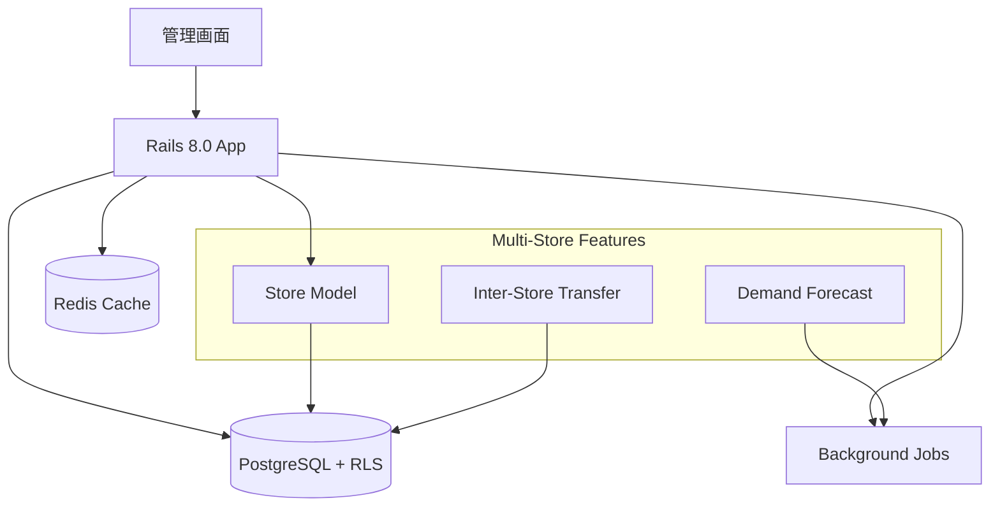
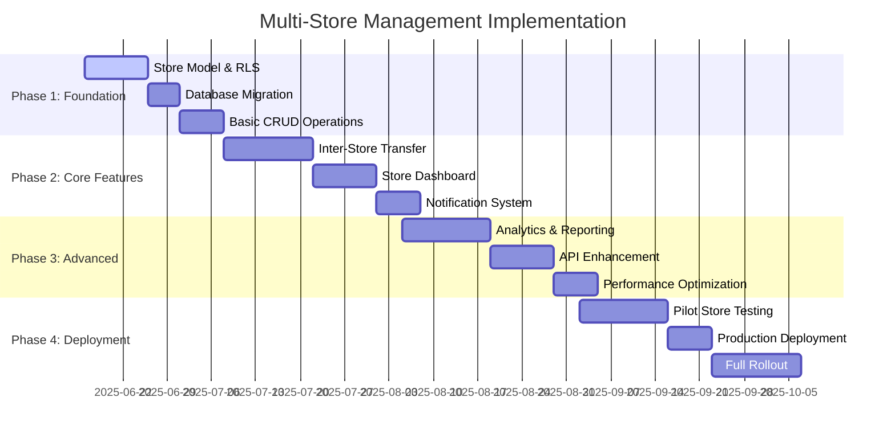

# StockRx Multi-Store Management Design Doc v1.0

```yaml
プロジェクト名: StockRx Multi-Store Inventory Management Enhancement  
作成日: 2025-06-15
作成者: StockRx Development Team
レビュアー: PM／PO／アーキテクト／セキュリティ
ステータス: Draft - Ready for Review
現在ブランチ: multi_store_management
```

## サマリー

### 一言要約（30文字以内）
> 既存薬局在庫システムに複数店舗統合管理機能を追加

### エレベーターピッチ（3文以内）
> 現在のStockRxは単一薬局向け在庫管理システムです。本機能拡張により複数店舗の在庫を一元管理し、店舗間在庫移動・需要予測・統合監査ログを実現します。薬局チェーン運営者の在庫最適化と業務効率化を支援し、過剰在庫とデッドストック問題を解決します。

---

## 1. なぜこの取り組みが必要か（Why）

### 解決すべき課題

```
【現状の問題】
・StockRxは単一店舗のみ対応、チェーン薬局には不適用
・店舗ごとの在庫データがサイロ化、全体最適化不可
↓
【結果として起きていること】
・本部管理者が店舗横断的な在庫状況を把握困難
・過剰在庫と欠品が同時発生、期限切れ廃棄コスト増
・手動集計による管理工数増大（月40-60時間）
↓  
【ビジネスへの影響】
・在庫保持コストが売上比8-12%に膨張、業界平均5-8%を上回る
・顧客満足度低下、競合への流出
```

### ステークホルダー別の価値提案

| ステークホルダー | 現在の課題 | 提供する価値 | 成功の定義 |
|----------------|------------|-------------|------------|
| **チェーン本部管理者** | 店舗データ手集計で全体最適不可 | 統合ダッシュボードと自動レポート | 管理工数-50%、在庫回転率+20% |
| **店舗管理者** | 他店在庫が見えず欠品対応遅れ | 店舗間在庫検索→移動申請ワンストップ | 欠品率-30%、顧客満足度向上 |
| **薬剤師** | 在庫不足で患者説明・調剤遅延 | 自動補充提案・リアルタイム在庫情報 | 調剤待ち時間-15% |

---

## 2. 何を実現するか（What）

### ゴール（Goals）

1. **主要目標**: 既存StockRxに複数店舗対応機能を追加、50店舗規模まで拡張可能
2. **副次目標**: 店舗間在庫移動ワークフローの電子化・自動化
3. **長期目標**: AI需要予測による最適在庫配置で保持コスト-15%削減

### スコープ外（Non-goals）

* **含まないもの**: POS・会計システム連携、人事管理機能、卸業者EDI
* **将来の検討事項**: IoTセンサー連携、ブロックチェーン実装、国際展開
* **他チームの責任範囲**: ハードウェア調達、ネットワーク構築、店舗研修

### 成功指標（Success Metrics）

| 指標カテゴリ | 指標名 | 現在値 | 目標値 | 測定方法 |
|-------------|-------|--------|--------|---------|
| **ビジネス** | 在庫回転率 | 4.2回/年 | 5.0回/年 | 売上÷平均在庫額（月次計測） |
| **技術** | システム稼働率 | - | 99.9% | Uptimeモニタリング |
| **運用** | 管理工数削減率 | 0% | 50% | 作業ログ時間計測 |
| **品質** | データ整合性 | - | 99.99% | 監査ログ検証 |

---

## 3. 誰のためか（Who）

### ユーザーストーリー

```gherkin
Feature: Multi-Store Inventory Management

  Scenario: 本部管理者がチェーン全体KPIを確認
    Given 本部管理者としてログイン済み
    When ダッシュボードを開く
    Then 全店舗の在庫総額・回転率が3秒以内に表示される
    So that 迅速な経営判断ができる

  Scenario: 店舗間在庫移動申請
    Given A店管理者として在庫不足を確認
    When 他店舗在庫を検索する
    Then B店の在庫状況が表示される
    And 5クリック以内で移動申請できる
    So that 顧客を待たせない

  Scenario: バッチ期限管理の統合
    Given 複数店舗でバッチを管理している
    When 期限切れが近いバッチを検索する
    Then 全店舗横断でFEFO順に表示される
    So that 廃棄ロスを最小化できる
```

### ペルソナ

* **プライマリ**: 5-50店舗を運営する薬局チェーン本部管理者
* **セカンダリ**: 各店舗管理者、薬剤師、在庫担当者
* **影響対象**: 患者、監査機関、薬事監督当局

---

## 4. どのように実現するか（How）

### アーキテクチャ概要



### 技術実装詳細

#### 4.1 データモデル拡張

```ruby
# 新規追加モデル
class Store < ApplicationRecord
  has_many :store_inventories, dependent: :destroy
  has_many :inventories, through: :store_inventories
  has_many :transfers_sent, class_name: 'InterStoreTransfer', foreign_key: 'source_store_id'
  has_many :transfers_received, class_name: 'InterStoreTransfer', foreign_key: 'destination_store_id'
  
  validates :code, presence: true, uniqueness: true
  validates :name, presence: true
end

class StoreInventory < ApplicationRecord
  belongs_to :store
  belongs_to :inventory
  validates :quantity, numericality: { greater_than_or_equal_to: 0 }
  
  # 既存Inventoryモデルとの互換性保持
  delegate :name, :price, :status, to: :inventory
end

class InterStoreTransfer < ApplicationRecord
  belongs_to :source_store, class_name: 'Store'
  belongs_to :destination_store, class_name: 'Store'
  belongs_to :inventory
  
  enum status: { pending: 0, approved: 1, in_transit: 2, completed: 3, cancelled: 4 }
  validates :quantity, numericality: { greater_than: 0 }
  validates :source_store_id, exclusion: { in: -> (transfer) { [transfer.destination_store_id] } }
end
```

#### 4.2 既存モデルの拡張

```ruby
# app/models/inventory.rb に追加
class Inventory < ApplicationRecord
  # 既存の関連はそのまま維持
  has_many :store_inventories, dependent: :destroy
  has_many :stores, through: :store_inventories
  has_many :inter_store_transfers, dependent: :destroy
  
  # チェーン全体での在庫数計算
  def total_quantity_across_stores
    store_inventories.sum(:quantity)
  end
  
  # 店舗別在庫状況
  def quantity_at_store(store)
    store_inventories.find_by(store: store)&.quantity || 0
  end
end
```

#### 4.3 Row Level Security (RLS) 実装

```sql
-- PostgreSQL RLS設定
ALTER TABLE stores ENABLE ROW LEVEL SECURITY;
ALTER TABLE store_inventories ENABLE ROW LEVEL SECURITY;
ALTER TABLE inter_store_transfers ENABLE ROW LEVEL SECURITY;

-- 管理者は全店舗アクセス可能
CREATE POLICY admin_all_access ON stores
  FOR ALL TO app_admin
  USING (true);

-- 店舗ユーザーは自店舗のみアクセス
CREATE POLICY store_user_access ON stores
  FOR ALL TO app_user
  USING (id = current_setting('app.current_store_id')::integer);
```

#### 4.4 コントローラー実装例

```ruby
# app/controllers/admin_controllers/stores_controller.rb
module AdminControllers
  class StoresController < BaseController
    def index
      @stores = Store.includes(:store_inventories, :inventories)
                   .with_attached_logo
                   .page(params[:page])
                   .per(50)
    end
    
    def dashboard
      @store_stats = StoreAnalyticsService.call(current_store)
      @low_stock_items = current_store.store_inventories
                                     .joins(:inventory)
                                     .where('quantity <= ?', 5)
                                     .includes(:inventory)
    end
  end
end

# app/controllers/admin_controllers/inter_store_transfers_controller.rb
module AdminControllers
  class InterStoreTransfersController < BaseController
    def create
      @transfer = InterStoreTransferService.call(transfer_params)
      
      if @transfer.persisted?
        TransferNotificationJob.perform_later(@transfer.id)
        redirect_to admin_transfers_path, notice: '移動申請を送信しました'
      else
        render :new, status: :unprocessable_entity
      end
    end
    
    private
    
    def transfer_params
      params.require(:inter_store_transfer)
            .permit(:source_store_id, :destination_store_id, :inventory_id, :quantity, :reason)
    end
  end
end
```

#### 4.5 サービスクラス実装

```ruby
# app/services/inter_store_transfer_service.rb
class InterStoreTransferService < ApplicationService
  def initialize(params)
    @params = params
  end
  
  def call
    ActiveRecord::Base.transaction do
      validate_transfer!
      create_transfer
      update_inventories if @transfer.approved?
      log_transfer_activity
      @transfer
    end
  rescue ActiveRecord::RecordInvalid => e
    Rails.logger.error "Transfer failed: #{e.message}"
    @transfer
  end
  
  private
  
  def validate_transfer!
    source_inventory = StoreInventory.find_by(
      store_id: @params[:source_store_id],
      inventory_id: @params[:inventory_id]
    )
    
    raise InsufficientStockError if source_inventory.quantity < @params[:quantity].to_i
  end
  
  def create_transfer
    @transfer = InterStoreTransfer.create!(@params)
  end
  
  def update_inventories
    # 在庫移動の実行
    source_inventory = StoreInventory.find_by(
      store_id: @transfer.source_store_id,
      inventory_id: @transfer.inventory_id
    )
    source_inventory.decrement!(:quantity, @transfer.quantity)
    
    destination_inventory = StoreInventory.find_or_create_by(
      store_id: @transfer.destination_store_id,
      inventory_id: @transfer.inventory_id
    )
    destination_inventory.increment!(:quantity, @transfer.quantity)
  end
end
```

### データベース設計

#### 新規テーブル

| テーブル名 | 説明 | 主要フィールド |
|-----------|------|----------------|
| `stores` | 店舗マスタ | code, name, address, manager_id |
| `store_inventories` | 店舗別在庫 | store_id, inventory_id, quantity |
| `inter_store_transfers` | 店舗間移動 | source_store_id, destination_store_id, inventory_id, quantity, status |

#### 既存テーブルの変更

```sql
-- admins テーブルに店舗関連付け
ALTER TABLE admins ADD COLUMN store_id INTEGER REFERENCES stores(id);
ALTER TABLE admins ADD COLUMN role VARCHAR(20) DEFAULT 'store_user';

-- インデックス追加（パフォーマンス最適化）
CREATE INDEX idx_store_inventories_store_inventory ON store_inventories(store_id, inventory_id);
CREATE INDEX idx_transfers_status_created ON inter_store_transfers(status, created_at);
```

---

## 5. リスクと対策（Risks）

### 技術的リスク

| リスク | 影響度 | 発生確率 | 対策 | 担当 |
|--------|--------|----------|------|------|
| RLS設定ミスでデータ漏洩 | High | Medium | 自動テスト+監査ログ強化 | Backend Lead |
| 在庫データ不整合 | High | Medium | トランザクション+整合性チェック | Database Team |
| 大量データでのパフォーマンス劣化 | Medium | High | インデックス最適化+キャッシュ戦略 | Performance Team |

### ビジネスリスク

| リスク | 影響度 | 発生確率 | 対策 | 担当 |
|--------|--------|----------|------|------|
| 既存ユーザーの混乱 | Medium | High | 段階的移行+十分な研修 | Product Team |
| 導入コスト超過 | Medium | Medium | MVP優先+段階展開 | PM |

### 失敗の判定基準

* [ ] 稼働率が月99%未満が継続
* [ ] 在庫データ不整合が月1回以上発生
* [ ] ユーザー満足度が70%未満
* [ ] 移行時データ喪失が発生

---

## 6. いつ実施するか（When）

### 実装フェーズ



### マイルストーン

| フェーズ | 期限 | 完了条件 | 成果物 |
|---------|------|----------|---------|
| Phase 1 | 07-07 | Store管理機能・RLS実装完了 | 基盤システム |
| Phase 2 | 08-04 | 店舗間移動機能実装・テスト合格 | コア機能 |
| Phase 3 | 09-01 | 分析・レポート機能実装完了 | 高度機能 |
| Phase 4 | 09-30 | 本番環境展開・運用開始 | 運用システム |

---

## 7. 検証と学習（Validation）

### 仮説検証計画

```
仮説1: 店舗間在庫移動機能により欠品率を30%削減できる
検証: パイロット店舗での3ヶ月間の欠品発生率計測

仮説2: 統合ダッシュボードにより管理工数を50%削減できる
検証: 管理者の作業時間ログ比較（導入前後）

仮説3: 在庫回転率を4.2回→5.0回に向上できる
検証: 月次在庫レポートでの回転率追跡
```

### A/Bテスト計画

* **対象**: パイロット5店舗 vs 従来運用5店舗
* **期間**: 3ヶ月間
* **成功基準**: 欠品率-30%、管理工数-40%、回転率+15%

---

## 8. 運用と保守（Operations）

### 監視項目

```yaml
SLIs:
  - availability: 99.9%
  - latency_p95: <500ms
  - error_rate: <0.1%
  - data_consistency: >99.99%

Alerts:
  - RLS policy violations
  - Inter-store transfer failures
  - Inventory data mismatches
  - Database performance degradation
```

### 運用プロセス

1. **日次監視**: データ整合性チェック、パフォーマンス監視
2. **週次レビュー**: 店舗間移動実績、エラー分析
3. **月次報告**: KPI達成状況、改善提案
4. **四半期評価**: システム価値評価、ロードマップ更新

### ドキュメント計画

* [ ] 多店舗管理ユーザーガイド
* [ ] 店舗間移動操作マニュアル
* [ ] 管理者向けダッシュボード解説
* [ ] API仕様書（Multi-Store対応）
* [ ] 運用Runbook（障害対応手順）

---

## 9. 代替案の検討（Alternatives）

| 代替案 | 概要 | 長所 | 短所 | 不採用理由 |
|--------|------|------|------|------------|
| **マルチテナント SaaS購入** | 汎用多店舗在庫SaaS | 即導入可能 | カスタマイズ不可 | 薬事法特殊要件に未対応 |
| **店舗別DB分割** | 店舗ごとに独立DB | データ完全分離 | 統合レポート困難 | チェーン全体最適化不可 |
| **マイクロサービス化** | 店舗管理を独立サービス | スケーラビリティ高 | 複雑性増大 | 既存資産活用を優先 |

---

## 10. 実装チェックリスト

### Phase 1: 基盤構築
- [ ] Store, StoreInventory, InterStoreTransfer モデル実装
- [ ] PostgreSQL RLS ポリシー設定
- [ ] データベースマイグレーション実行
- [ ] 基本CRUD操作テスト実装
- [ ] 認証・認可機能拡張

### Phase 2: コア機能
- [ ] 店舗間移動申請ワークフロー
- [ ] 在庫検索・フィルタリング機能
- [ ] 通知システム（メール・画面内）
- [ ] 移動履歴・監査ログ
- [ ] バッチ処理の店舗対応

### Phase 3: 高度機能
- [ ] 統合ダッシュボード実装
- [ ] 分析・レポート機能
- [ ] 需要予測アルゴリズム
- [ ] パフォーマンス最適化
- [ ] API v2実装（Multi-Store対応）

### Phase 4: 運用準備
- [ ] パイロット環境構築
- [ ] 運用監視設定
- [ ] ユーザー研修資料作成
- [ ] 障害対応手順書作成
- [ ] 本番環境展開

---

## 補足情報（Appendix）

### 現在の技術スタック

```yaml
Backend: Ruby on Rails 8.0
Database: PostgreSQL (Row Level Security)
Cache: Redis
Background Jobs: Sidekiq
Authentication: Devise (Admin model)
Frontend: Turbo + Stimulus
Testing: RSpec + FactoryBot
CI/CD: GitHub Actions
Deployment: Docker + Make commands
```

### 関連ファイル

* モデル: `app/models/inventory.rb`, `app/models/batch.rb`
* コントローラー: `app/controllers/admin_controllers/inventories_controller.rb`
* 設定: `config/routes.rb`, `CLAUDE.md`
* テスト: `spec/models/`, `spec/controllers/`

### 参考資料

* [PostgreSQL Row Level Security](https://www.postgresql.org/docs/current/ddl-rowsecurity.html)
* [Rails 8.0 Release Notes](https://guides.rubyonrails.org/8_0_release_notes.html)
* [Sidekiq Best Practices](https://github.com/mperham/sidekiq/wiki/Best-Practices)

---

## レビューチェックリスト

**ビジネス要件**
- [ ] ステークホルダー価値提案が明確
- [ ] ROI計算根拠が妥当
- [ ] リスク評価が適切

**技術設計**
- [ ] 既存アーキテクチャとの整合性
- [ ] RLS実装の安全性
- [ ] パフォーマンス影響の評価
- [ ] テスト戦略の妥当性

**運用・保守**
- [ ] 監視項目の網羅性
- [ ] 障害対応手順の明確性
- [ ] ドキュメント計画の充実

---

### 改訂履歴

| 日付 | バージョン | 変更内容 | 変更者 |
|------|------------|----------|---------|
| 2025-06-15 | v1.0-draft | 初版作成（現行システム仕様ベース） | Development Team |

---

**実装への一歩**
> 単店舗から複数店舗へ。在庫の最適化は、システムの進化から始まる。