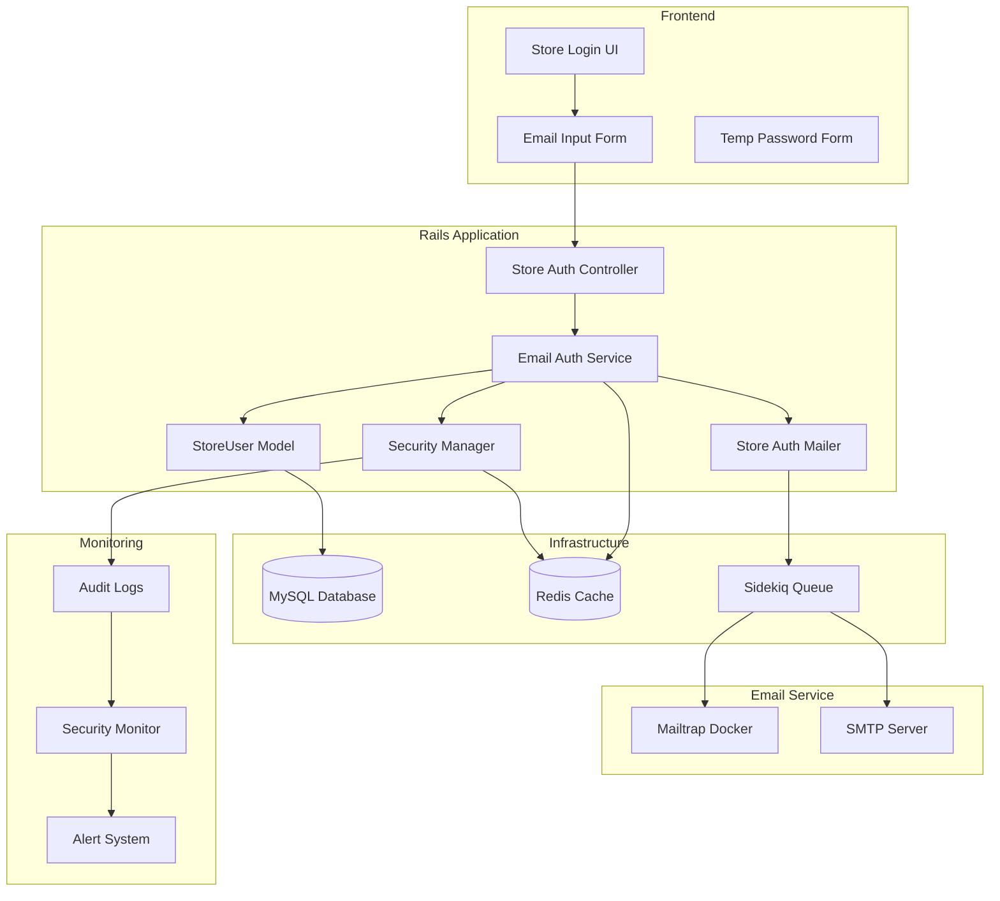
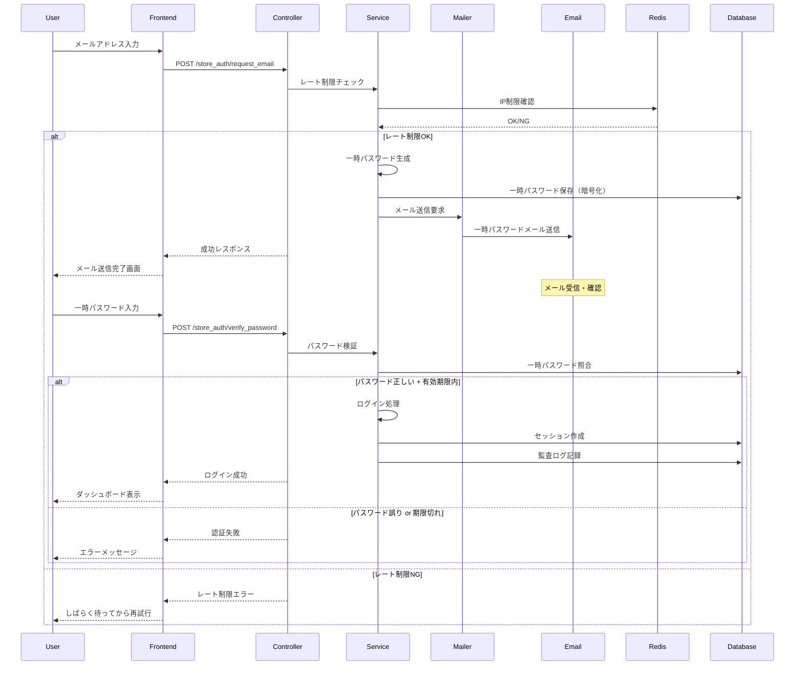

# 🔐 店舗ログイン時メール認証機能 Design Document

## 📋 目次
1. [プロジェクト概要](#プロジェクト概要)
2. [要件分析](#要件分析)
3. [アーキテクチャ設計](#アーキテクチャ設計)
4. [セキュリティ設計](#セキュリティ設計)
5. [ワークフロー設計](#ワークフロー設計)
6. [技術仕様書](#技術仕様書)
7. [実装計画](#実装計画)
8. [テスト戦略](#テスト戦略)
9. [運用計画](#運用計画)

---

## 📖 プロジェクト概要

### 🎯 目的
店舗ユーザーのログイン時に、登録されたメールアドレスに一時パスワードを送信し、そのパスワードを入力することでログインできるセキュアな認証システムを構築する。

### 🌟 背景
- **セキュリティ強化**: 従来のパスワード認証に加えて、メール認証による多層防御
- **ユーザビリティ向上**: パスワード忘れによるロックアウト防止
- **監査要件**: PCI DSS/GDPR準拠のアクセス制御強化
- **運用効率化**: 管理者によるパスワードリセット作業の削減

### 🎯 成功指標
- **セキュリティ**: 不正ログイン試行の95%以上削減
- **ユーザビリティ**: ログイン完了率95%以上維持
- **運用効率**: パスワードリセット作業50%削減
- **コンプライアンス**: PCI DSS/GDPR要件100%準拠

---

## 🔍 要件分析

### 📝 ユーザーストーリー

#### 👤 店舗ユーザー
```gherkin
As a 店舗ユーザー
I want to ログイン時にメールで一時パスワードを受け取る
So that より安全にシステムにアクセスできる

Acceptance Criteria:
- メールアドレスを入力してログインボタンを押す
- 登録されたメールアドレスに一時パスワードが送信される
- 一時パスワードを入力してログイン完了
- 一時パスワードは15分で自動失効
- 失効後は新しい一時パスワードを再送信可能
```

#### 🛡️ セキュリティ管理者
```gherkin
As a セキュリティ管理者
I want to ログイン試行を監視・制御する
So that 不正アクセスを防止できる

Acceptance Criteria:
- 同一IPからの連続ログイン試行を制限（5回/15分）
- 不正ログイン試行の自動検知・アラート
- ログイン成功・失敗の詳細な監査ログ
- 一時パスワードのブルートフォース対策
```

#### 👥 システム管理者
```gherkin
As a システム管理者
I want to メール送信システムを監視・管理する
So that 安定したサービスを提供できる

Acceptance Criteria:
- メール送信成功・失敗の監視
- Mailtrap（開発）・SMTP（本番）の統合管理
- メール送信キューの監視・制御
- 一時パスワード生成・管理の統計
```

### 🎯 機能要件

#### Core Features (MVP)
1. **メール認証ログイン**
   - メールアドレス入力によるログイン要求
   - 一時パスワードのメール送信
   - 一時パスワードによる認証完了

2. **一時パスワード管理**
   - セキュアな一時パスワード生成（8桁英数字）
   - 15分自動失効機能
   - 使用済み一時パスワードの無効化

3. **セキュリティ制御**
   - レート制限（5回/15分）
   - セッション管理・自動ログアウト
   - 監査ログ記録

#### Enhanced Features (Phase 2)
1. **多言語対応**
   - 日本語・英語メールテンプレート
   - エラーメッセージ国際化

2. **高度なセキュリティ**
   - IP地域制限・ブラックリスト
   - 異常行動検知・自動ブロック

3. **運用機能**
   - 管理者ダッシュボード
   - 一括メール送信・通知機能

### 📊 非機能要件

#### Performance
- **メール送信**: 3秒以内
- **ログイン完了**: 5秒以内
- **同時ユーザー数**: 100ユーザー
- **可用性**: 99.9% SLA

#### Security
- **暗号化**: AES-256-GCM
- **一時パスワード**: 暗号学的安全な乱数
- **セッション**: HttpOnly/Secure Cookie
- **監査ログ**: 改ざん防止ハッシュ

#### Usability
- **レスポンシブデザイン**: モバイル対応
- **アクセシビリティ**: WCAG 2.1 AA準拠
- **多言語対応**: 日本語・英語

---

## 🏗️ アーキテクチャ設計

### 🌐 システム構成図



### 🔗 コンポーネント設計

#### 1. StoreAuthController
```ruby
# 責務: 店舗認証フローの制御
class StoreAuthController < ApplicationController
  # メール送信要求
  def request_auth_email
  
  # 一時パスワード認証
  def verify_temp_password
  
  # ログアウト
  def logout
end
```

#### 2. EmailAuthService
```ruby
# 責務: メール認証ビジネスロジック
class EmailAuthService
  # 一時パスワード生成・送信
  def send_temp_password(email)
  
  # 一時パスワード検証
  def verify_temp_password(email, temp_password)
  
  # レート制限チェック
  def check_rate_limit(ip_address)
end
```

#### 3. StoreAuthMailer
```ruby
# 責務: 認証メール送信
class StoreAuthMailer < ApplicationMailer
  # 一時パスワード送信メール
  def temp_password_email(store_user, temp_password)
  
  # ログイン成功通知メール
  def login_success_notification(store_user)
end
```

#### 4. TempPassword Model
```ruby
# 責務: 一時パスワード管理
class TempPassword < ApplicationRecord
  belongs_to :store_user
  
  # 一時パスワード生成
  def self.generate_for(store_user)
  
  # 有効期限チェック
  def expired?
  
  # 使用済み処理
  def mark_as_used!
end
```

### 📊 データベース設計

#### temp_passwords テーブル
```sql
CREATE TABLE temp_passwords (
  id BIGINT PRIMARY KEY AUTO_INCREMENT,
  store_user_id BIGINT NOT NULL,
  password_hash VARCHAR(255) NOT NULL,
  expires_at DATETIME NOT NULL,
  used_at DATETIME NULL,
  ip_address VARCHAR(45) NULL,
  user_agent TEXT NULL,
  created_at DATETIME NOT NULL,
  updated_at DATETIME NOT NULL,
  
  FOREIGN KEY (store_user_id) REFERENCES store_users(id),
  INDEX idx_store_user_expires (store_user_id, expires_at),
  INDEX idx_expires_used (expires_at, used_at),
  INDEX idx_ip_created (ip_address, created_at)
);
```

#### store_auth_logs テーブル
```sql
CREATE TABLE store_auth_logs (
  id BIGINT PRIMARY KEY AUTO_INCREMENT,
  store_user_id BIGINT NULL,
  email VARCHAR(255) NOT NULL,
  action VARCHAR(50) NOT NULL, -- 'request_email', 'verify_password', 'login_success'
  result VARCHAR(20) NOT NULL, -- 'success', 'failure', 'rate_limited'
  ip_address VARCHAR(45) NULL,
  user_agent TEXT NULL,
  details JSON NULL,
  created_at DATETIME NOT NULL,
  
  FOREIGN KEY (store_user_id) REFERENCES store_users(id),
  INDEX idx_email_action_created (email, action, created_at),
  INDEX idx_ip_created (ip_address, created_at),
  INDEX idx_result_created (result, created_at)
);
```

---

## 🛡️ セキュリティ設計

### 🔒 脅威モデリング

#### 主要脅威と対策

| 脅威 | リスクレベル | 対策 |
|------|-------------|------|
| **ブルートフォース攻撃** | High | レート制限（5回/15分）、IP制限、アカウントロック |
| **フィッシング攻撃** | High | メール送信元検証、HTTPSのみ、セキュリティヘッダー |
| **セッションハイジャック** | Medium | Secure Cookie、HttpOnly、SameSite設定 |
| **メール傍受** | Medium | 一時パスワード15分失効、使用後即時無効化 |
| **リプレイ攻撃** | Medium | ワンタイム一時パスワード、CSRF対策 |
| **タイミング攻撃** | Low | 定数時間応答、SecurityComplianceManager活用 |

### 🔐 セキュリティ機能実装

#### 1. 一時パスワード生成
```ruby
# 暗号学的に安全な乱数を使用
def generate_temp_password
  # 8桁英数字（大文字・小文字・数字）
  charset = ('A'..'Z').to_a + ('a'..'z').to_a + ('0'..'9').to_a
  # 混同しやすい文字を除外（0, O, l, I等）
  charset -= %w[0 O l I 1]
  
  Array.new(8) { charset.sample(random: SecureRandom) }.join
end

# BCryptでハッシュ化して保存
def hash_temp_password(plain_password)
  BCrypt::Password.create(plain_password, cost: 12)
end
```

#### 2. レート制限実装
```ruby
class RateLimiter
  # Redis使用（分散環境対応）
  def check_rate_limit(key, limit: 5, window: 15.minutes)
    current_count = Rails.cache.read("rate_limit:#{key}") || 0
    
    if current_count >= limit
      SecurityComplianceManager.instance.log_pci_dss_event(
        'rate_limit_exceeded', 
        nil, 
        { key: key, count: current_count }
      )
      return false
    end
    
    Rails.cache.write(
      "rate_limit:#{key}", 
      current_count + 1, 
      expires_in: window
    )
    true
  end
end
```

#### 3. セッション管理
```ruby
# store_auth_controller.rb
def after_login_success(store_user)
  # セッション再生成（Session Fixation対策）
  reset_session
  
  # セキュアなセッション設定
  session[:store_user_id] = store_user.id
  session[:login_time] = Time.current
  session[:ip_address] = request.remote_ip
  
  # 30分自動ログアウト
  session[:expires_at] = 30.minutes.from_now
  
  # ComplianceAuditLog記録
  ComplianceAuditLog.log_security_event(
    'store_login_success',
    store_user,
    'PCI_DSS',
    'medium',
    {
      ip_address: request.remote_ip,
      user_agent: request.user_agent,
      login_method: 'email_temp_password'
    }
  )
end
```

### 🚨 監視・アラート

#### 異常検知パターン
1. **短時間大量ログイン試行**: 同一IP/5分以内/10回以上
2. **地理的異常**: 通常と異なる地域からのアクセス
3. **時間的異常**: 営業時間外の大量アクセス
4. **パスワード試行異常**: 連続失敗後の成功

#### アラート設定
```ruby
class SecurityMonitor
  def detect_anomaly(auth_log)
    # 地理的異常検知
    if suspicious_location?(auth_log.ip_address)
      send_security_alert(
        type: 'geographical_anomaly',
        details: auth_log,
        severity: 'high'
      )
    end
    
    # ブルートフォース検知
    if brute_force_pattern?(auth_log.email)
      send_security_alert(
        type: 'brute_force_attempt',
        details: auth_log,
        severity: 'critical'
      )
    end
  end
end
```

---

## 🔄 ワークフロー設計

### 📱 ユーザーフロー



### ⏱️ タイムライン設計

#### 正常フロー
1. **T+0s**: メールアドレス入力・送信ボタン押下
2. **T+1s**: レート制限・バリデーション完了
3. **T+2s**: 一時パスワード生成・DB保存完了
4. **T+3s**: メール送信完了・成功画面表示
5. **T+15s**: ユーザーがメール確認・一時パスワード取得
6. **T+30s**: 一時パスワード入力・認証完了
7. **T+15min**: 一時パスワード自動失効

#### エラーフロー
- **無効メール**: 即座にエラー（ユーザー列挙防止のため通常と同じ応答時間）
- **レート制限**: 429エラー、次回試行可能時刻表示
- **メール送信失敗**: リトライ機構、管理者アラート
- **期限切れ**: 新しい一時パスワード再送信可能

---

## 📋 技術仕様書

### 🎨 UI/UX設計

#### ログイン画面設計
```erb
<!-- app/views/store_auth/login.html.erb -->
<div class="store-auth-container">
  <div class="auth-card">
    <h2 class="auth-title">店舗ログイン</h2>
    
    <%= form_with url: store_auth_request_email_path, 
                  method: :post, 
                  local: true, 
                  class: "auth-form" do |form| %>
      
      <div class="form-group">
        <%= form.label :email, "メールアドレス", class: "form-label" %>
        <%= form.email_field :email, 
                             class: "form-control", 
                             placeholder: "store@example.com",
                             required: true,
                             autocomplete: "email" %>
      </div>
      
      <div class="form-actions">
        <%= form.submit "ログイン用パスワードを送信", 
                        class: "btn btn-primary btn-block",
                        data: { 
                          disable_with: "送信中...",
                          confirm: "入力したメールアドレスに一時パスワードを送信します。よろしいですか？"
                        } %>
      </div>
      
    <% end %>
    
    <div class="auth-help">
      <small class="text-muted">
        • 登録されたメールアドレスに一時パスワードが送信されます<br>
        • 一時パスワードは15分間有効です<br>
        • 受信できない場合は管理者にお問い合わせください
      </small>
    </div>
  </div>
</div>
```

#### パスワード入力画面設計
```erb
<!-- app/views/store_auth/verify.html.erb -->
<div class="store-auth-container">
  <div class="auth-card">
    <h2 class="auth-title">一時パスワード入力</h2>
    
    <div class="auth-info">
      <p class="info-text">
        <strong><%= params[:email] %></strong> に一時パスワードを送信しました。
      </p>
      <p class="info-text">
        メールに記載された8桁のパスワードを入力してください。
      </p>
    </div>
    
    <%= form_with url: store_auth_verify_password_path,
                  method: :post,
                  local: true,
                  class: "auth-form" do |form| %>
      
      <%= form.hidden_field :email, value: params[:email] %>
      
      <div class="form-group">
        <%= form.label :temp_password, "一時パスワード", class: "form-label" %>
        <%= form.text_field :temp_password,
                            class: "form-control temp-password-input",
                            placeholder: "AB12CD34",
                            maxlength: 8,
                            required: true,
                            autocomplete: "one-time-code" %>
      </div>
      
      <div class="form-actions">
        <%= form.submit "ログイン", 
                        class: "btn btn-success btn-block",
                        data: { disable_with: "認証中..." } %>
      </div>
      
    <% end %>
    
    <div class="auth-actions">
      <%= link_to "一時パスワードを再送信", 
                  store_auth_resend_path(email: params[:email]),
                  method: :post,
                  class: "btn btn-outline-secondary btn-sm",
                  data: { 
                    confirm: "一時パスワードを再送信しますか？",
                    disable_with: "送信中..."
                  } %>
      
      <%= link_to "メールアドレスを変更", 
                  store_auth_login_path,
                  class: "btn btn-outline-primary btn-sm" %>
    </div>
    
    <div class="auth-timer" data-expires-at="<%= 15.minutes.from_now.to_i %>">
      <small class="text-warning">
        残り時間: <span class="countdown">15:00</span>
      </small>
    </div>
  </div>
</div>
```

### 📡 API設計

#### エンドポイント一覧
```ruby
# config/routes.rb
Rails.application.routes.draw do
  namespace :store_auth do
    get  :login                    # ログイン画面表示
    post :request_email           # メール送信要求
    get  :verify                  # パスワード入力画面表示
    post :verify_password         # パスワード認証
    post :resend                  # パスワード再送信
    delete :logout               # ログアウト
  end
end
```

#### API詳細仕様

##### POST /store_auth/request_email
```json
{
  "summary": "一時パスワードのメール送信要求",
  "parameters": {
    "email": {
      "type": "string",
      "format": "email",
      "required": true,
      "example": "store@example.com"
    }
  },
  "responses": {
    "200": {
      "description": "送信成功",
      "body": {
        "status": "success",
        "message": "一時パスワードを送信しました",
        "expires_at": "2024-01-01T12:15:00Z"
      }
    },
    "429": {
      "description": "レート制限",
      "body": {
        "status": "error",
        "message": "しばらく待ってから再試行してください",
        "retry_after": 900
      }
    },
    "422": {
      "description": "バリデーションエラー",
      "body": {
        "status": "error",
        "message": "有効なメールアドレスを入力してください",
        "errors": ["メールアドレスの形式が正しくありません"]
      }
    }
  }
}
```

##### POST /store_auth/verify_password
```json
{
  "summary": "一時パスワード認証",
  "parameters": {
    "email": {
      "type": "string", 
      "format": "email",
      "required": true
    },
    "temp_password": {
      "type": "string",
      "pattern": "^[A-Za-z0-9]{8}$",
      "required": true
    }
  },
  "responses": {
    "200": {
      "description": "認証成功",
      "body": {
        "status": "success",
        "message": "ログインしました",
        "redirect_url": "/store/dashboard"
      }
    },
    "401": {
      "description": "認証失敗",
      "body": {
        "status": "error",
        "message": "一時パスワードが正しくありません",
        "attempts_remaining": 3
      }
    },
    "410": {
      "description": "期限切れ",
      "body": {
        "status": "error", 
        "message": "一時パスワードの有効期限が切れています",
        "can_resend": true
      }
    }
  }
}
```

### 📧 メール設計

#### テンプレート設計
```erb
<!-- app/views/store_auth_mailer/temp_password_email.html.erb -->
<!DOCTYPE html>
<html>
<head>
  <meta charset="utf-8">
  <meta name="viewport" content="width=device-width, initial-scale=1">
  <title>StockRx - ログイン用一時パスワード</title>
  <style>
    .email-container { max-width: 600px; margin: 0 auto; font-family: 'Hiragino Sans', 'メイリオ', sans-serif; }
    .header { background: #2c3e50; color: white; padding: 20px; text-align: center; }
    .content { padding: 30px 20px; background: #ffffff; }
    .temp-password { 
      background: #f8f9fa; 
      border: 2px solid #007bff; 
      padding: 20px; 
      text-align: center; 
      margin: 20px 0;
      border-radius: 8px;
    }
    .temp-password-value { 
      font-size: 28px; 
      font-weight: bold; 
      color: #007bff; 
      letter-spacing: 2px;
      font-family: 'Courier New', monospace;
    }
    .warning { background: #fff3cd; border-left: 4px solid #ffc107; padding: 15px; margin: 20px 0; }
    .footer { background: #f8f9fa; padding: 20px; text-align: center; color: #6c757d; font-size: 14px; }
  </style>
</head>
<body>
  <div class="email-container">
    <div class="header">
      <h1>🏪 StockRx</h1>
      <p>店舗ログイン用一時パスワード</p>
    </div>
    
    <div class="content">
      <h2>こんにちは、<%= @store_user.name %>さん</h2>
      
      <p>StockRx店舗システムへのログイン要求を受け付けました。</p>
      <p>以下の一時パスワードを使用してログインしてください。</p>
      
      <div class="temp-password">
        <p><strong>一時パスワード</strong></p>
        <div class="temp-password-value"><%= @temp_password %></div>
      </div>
      
      <div class="warning">
        <h4>⚠️ 重要な注意事項</h4>
        <ul>
          <li><strong>有効期限:</strong> <%= @expires_at.strftime('%Y年%m月%d日 %H:%M') %>まで（15分間）</li>
          <li><strong>使用回数:</strong> 1回のみ使用可能</li>
          <li><strong>セキュリティ:</strong> このパスワードは他人に教えないでください</li>
          <li><strong>覚えがない場合:</strong> 管理者にすぐに連絡してください</li>
        </ul>
      </div>
      
      <div style="text-align: center; margin: 30px 0;">
        <a href="<%= @login_url %>" 
           style="background: #007bff; color: white; padding: 15px 30px; text-decoration: none; border-radius: 5px; display: inline-block;">
          ログインページにアクセス
        </a>
      </div>
      
      <div>
        <h4>ログイン情報</h4>
        <ul>
          <li><strong>店舗:</strong> <%= @store_user.store.name %></li>
          <li><strong>要求時刻:</strong> <%= Time.current.strftime('%Y年%m月%d日 %H:%M:%S') %></li>
          <li><strong>IPアドレス:</strong> <%= @ip_address %></li>
        </ul>
      </div>
    </div>
    
    <div class="footer">
      <p>このメールは自動送信されています。返信しないでください。</p>
      <p>StockRx在庫管理システム | お問い合わせ: support@stockrx.example.com</p>
    </div>
  </div>
</body>
</html>
```

#### Mailtrap統合設定
```ruby
# config/environments/development.rb
Rails.application.configure do
  # Mailtrap Docker設定
  config.action_mailer.delivery_method = :smtp
  config.action_mailer.smtp_settings = {
    address: 'localhost',
    port: 1025,
    domain: 'localhost',
    authentication: :plain,
    enable_starttls_auto: false
  }
  
  # URL設定
  config.action_mailer.default_url_options = { 
    host: 'localhost', 
    port: 3000,
    protocol: 'http'
  }
  
  # メール送信ログ
  config.action_mailer.logger = Logger.new(STDOUT)
  config.action_mailer.log_level = :debug
end
```

```yaml
# docker-compose.yml（Mailtrap追加）
version: '3.8'
services:
  # 既存サービス...
  
  mailtrap:
    image: mailhog/mailhog:latest
    container_name: stockrx-mailtrap
    ports:
      - "1025:1025"  # SMTP
      - "8025:8025"  # Web UI
    profiles:
      - dev
    networks:
      - stockrx-network
    environment:
      - MH_STORAGE=maildir
      - MH_MAILDIR_PATH=/tmp
    volumes:
      - mailtrap-data:/tmp
    restart: unless-stopped

volumes:
  mailtrap-data:
    driver: local
```

---

## 🚀 実装計画

### 📅 開発フェーズ

#### Phase 1: 基盤実装（Week 1-2）
**目標**: 基本的なメール認証機能の実装

**Tasks**:
- [ ] TempPasswordモデル作成・マイグレーション
- [ ] StoreAuthControllerの基本実装
- [ ] EmailAuthServiceの実装
- [ ] StoreAuthMailerの実装
- [ ] 基本的なUI実装（ログイン・パスワード入力画面）
- [ ] Mailtrap Docker統合
- [ ] 基本テストの実装

**Deliverables**:
- 動作するメール認証ログイン機能
- Mailtrap環境での動作確認完了
- 基本的なセキュリティ対策（レート制限・暗号化）

#### Phase 2: セキュリティ強化（Week 3）
**目標**: 本番環境レベルのセキュリティ実装

**Tasks**:
- [ ] SecurityComplianceManager統合
- [ ] 詳細な監査ログ実装（ComplianceAuditLog連携）
- [ ] 高度なレート制限・異常検知
- [ ] セッション管理・自動ログアウト
- [ ] CSRF対策・セキュリティヘッダー
- [ ] セキュリティテストの実装

**Deliverables**:
- PCI DSS/GDPR準拠のセキュリティ機能
- 包括的な監査ログ・監視機能
- セキュリティペネトレーションテスト完了

#### Phase 3: UI/UX改善（Week 4）
**目標**: ユーザビリティとアクセシビリティの向上

**Tasks**:
- [ ] レスポンシブデザイン実装
- [ ] アクセシビリティ対応（WCAG 2.1 AA）
- [ ] 多言語対応（日本語・英語）
- [ ] プログレッシブエンハンスメント
- [ ] ユーザビリティテスト
- [ ] パフォーマンス最適化

**Deliverables**:
- モバイル対応UI
- WCAG 2.1 AA準拠
- 国際化対応
- 高いユーザビリティスコア

#### Phase 4: 運用機能（Week 5）
**目標**: 運用・監視・管理機能の実装

**Tasks**:
- [ ] 管理者ダッシュボード機能
- [ ] メール送信統計・監視機能
- [ ] ログ分析・レポート機能
- [ ] 本番環境デプロイメント
- [ ] 運用ドキュメント作成
- [ ] 運用テスト・障害復旧テスト

**Deliverables**:
- 本番環境稼働
- 運用ダッシュボード
- 包括的な運用ドキュメント
- 障害対応手順書

### 🎯 マイルストーン

| Milestone | 期限 | 成功基準 |
|-----------|------|----------|
| **MVP完成** | Week 2 | 基本的なメール認証ログイン動作 |
| **セキュリティ完成** | Week 3 | セキュリティ要件100%満足 |
| **UI/UX完成** | Week 4 | ユーザビリティテスト90%以上 |
| **本番稼働** | Week 5 | 本番環境での安定動作確認 |

### 👥 役割分担

#### バックエンド開発者
- モデル・コントローラー・サービス実装
- セキュリティ機能実装
- API設計・実装
- テスト実装

#### フロントエンド開発者
- UI/UX設計・実装
- レスポンシブデザイン
- アクセシビリティ対応
- JavaScript機能実装

#### セキュリティエンジニア
- セキュリティ要件定義
- 脅威モデリング
- ペネトレーションテスト
- セキュリティ監査

#### QAエンジニア
- テスト計画策定
- テストケース作成
- 自動テスト実装
- ユーザビリティテスト

---

## 🧪 テスト戦略

### 🎯 テスト方針

#### テストピラミッド
```
        /\
       /  \    E2E Tests
      /____\   (5% - 重要フロー)
     /      \
    /        \  Integration Tests  
   /__________\ (20% - API・メール送信)
  /            \
 /              \ Unit Tests
/________________\ (75% - モデル・サービス)
```

### 📝 テストケース設計

#### 1. Unit Tests
```ruby
# spec/models/temp_password_spec.rb
RSpec.describe TempPassword, type: :model do
  describe 'validations' do
    it { should belong_to(:store_user) }
    it { should validate_presence_of(:password_hash) }
    it { should validate_presence_of(:expires_at) }
  end
  
  describe '#expired?' do
    it 'returns true when past expiration time' do
      temp_password = create(:temp_password, expires_at: 1.minute.ago)
      expect(temp_password.expired?).to be true
    end
    
    it 'returns false when within expiration time' do
      temp_password = create(:temp_password, expires_at: 1.minute.from_now)
      expect(temp_password.expired?).to be false
    end
  end
  
  describe '#verify_password' do
    let(:plain_password) { 'AB12CD34' }
    let(:temp_password) { create(:temp_password, password_hash: BCrypt::Password.create(plain_password)) }
    
    it 'returns true for correct password' do
      expect(temp_password.verify_password(plain_password)).to be true
    end
    
    it 'returns false for incorrect password' do
      expect(temp_password.verify_password('WRONG123')).to be false
    end
  end
end

# spec/services/email_auth_service_spec.rb
RSpec.describe EmailAuthService do
  let(:store_user) { create(:store_user) }
  let(:service) { described_class.new }
  
  describe '#send_temp_password' do
    it 'generates and sends temp password' do
      expect {
        service.send_temp_password(store_user.email)
      }.to change(TempPassword, :count).by(1)
      
      expect(ActionMailer::Base.deliveries).not_to be_empty
    end
    
    it 'respects rate limiting' do
      # 5回送信
      5.times { service.send_temp_password(store_user.email) }
      
      # 6回目は失敗
      expect {
        service.send_temp_password(store_user.email)
      }.to raise_error(EmailAuthService::RateLimitError)
    end
  end
  
  describe '#verify_temp_password' do
    let(:temp_password) { service.send_temp_password(store_user.email) }
    
    it 'succeeds with correct password within time limit' do
      result = service.verify_temp_password(store_user.email, temp_password)
      expect(result).to be_success
    end
    
    it 'fails with incorrect password' do
      result = service.verify_temp_password(store_user.email, 'WRONG123')
      expect(result).to be_failure
      expect(result.error).to eq('パスワードが正しくありません')
    end
    
    it 'fails with expired password' do
      travel_to 16.minutes.from_now do
        result = service.verify_temp_password(store_user.email, temp_password)
        expect(result).to be_failure
        expect(result.error).to eq('一時パスワードの有効期限が切れています')
      end
    end
  end
end
```

#### 2. Integration Tests
```ruby
# spec/requests/store_auth_spec.rb
RSpec.describe 'Store Authentication', type: :request do
  let(:store_user) { create(:store_user) }
  
  describe 'POST /store_auth/request_email' do
    it 'sends temp password email successfully' do
      post store_auth_request_email_path, params: { email: store_user.email }
      
      expect(response).to have_http_status(:ok)
      expect(JSON.parse(response.body)['status']).to eq('success')
      expect(ActionMailer::Base.deliveries).not_to be_empty
      
      email = ActionMailer::Base.deliveries.last
      expect(email.to).to include(store_user.email)
      expect(email.subject).to include('一時パスワード')
    end
    
    it 'returns rate limit error after excessive requests' do
      # Rate limit: 5 requests per 15 minutes
      5.times do
        post store_auth_request_email_path, params: { email: store_user.email }
      end
      
      post store_auth_request_email_path, params: { email: store_user.email }
      
      expect(response).to have_http_status(:too_many_requests)
      expect(JSON.parse(response.body)['status']).to eq('error')
    end
    
    it 'handles invalid email gracefully' do
      post store_auth_request_email_path, params: { email: 'invalid@example.com' }
      
      # セキュリティ：ユーザー列挙防止のため正常と同じレスポンス
      expect(response).to have_http_status(:ok)
      expect(ActionMailer::Base.deliveries).to be_empty
    end
  end
  
  describe 'POST /store_auth/verify_password' do
    let(:temp_password_value) { 'AB12CD34' }
    let!(:temp_password) do
      create(:temp_password, 
             store_user: store_user,
             password_hash: BCrypt::Password.create(temp_password_value),
             expires_at: 15.minutes.from_now)
    end
    
    it 'logs in successfully with correct password' do
      post store_auth_verify_password_path, 
           params: { 
             email: store_user.email, 
             temp_password: temp_password_value 
           }
      
      expect(response).to redirect_to(store_dashboard_path)
      expect(session[:store_user_id]).to eq(store_user.id)
      
      # 一時パスワードが使用済みになることを確認
      temp_password.reload
      expect(temp_password.used_at).not_to be_nil
    end
    
    it 'fails with incorrect password' do
      post store_auth_verify_password_path,
           params: {
             email: store_user.email,
             temp_password: 'WRONG123'
           }
      
      expect(response).to have_http_status(:unauthorized)
      expect(session[:store_user_id]).to be_nil
    end
    
    it 'creates audit log for login attempts' do
      expect {
        post store_auth_verify_password_path,
             params: {
               email: store_user.email,
               temp_password: temp_password_value
             }
      }.to change(ComplianceAuditLog, :count).by(1)
      
      audit_log = ComplianceAuditLog.last
      expect(audit_log.event_type).to eq('store_login_success')
      expect(audit_log.user).to eq(store_user)
    end
  end
end
```

#### 3. E2E Tests
```ruby
# spec/system/store_login_spec.rb
RSpec.describe 'Store Login System', type: :system do
  let(:store_user) { create(:store_user, email: 'test@example.com') }
  
  before do
    driven_by(:rack_test)
  end
  
  scenario 'Complete login flow with email authentication' do
    # Step 1: ログイン画面にアクセス
    visit store_auth_login_path
    expect(page).to have_content('店舗ログイン')
    
    # Step 2: メールアドレス入力
    fill_in 'メールアドレス', with: store_user.email
    click_button 'ログイン用パスワードを送信'
    
    # Step 3: メール送信完了画面
    expect(page).to have_content('一時パスワードを送信しました')
    expect(current_path).to eq(store_auth_verify_path)
    
    # Step 4: メール内容確認（テスト環境）
    email = ActionMailer::Base.deliveries.last
    expect(email.to).to include(store_user.email)
    
    # メールから一時パスワードを抽出
    temp_password = email.body.to_s.match(/([A-Z0-9]{8})/)[1]
    
    # Step 5: 一時パスワード入力
    fill_in '一時パスワード', with: temp_password
    click_button 'ログイン'
    
    # Step 6: ログイン成功確認
    expect(page).to have_content('ダッシュボード')
    expect(current_path).to eq(store_dashboard_path)
    
    # Step 7: セッション確認
    expect(page).to have_content(store_user.name)
  end
  
  scenario 'Expired password handling' do
    visit store_auth_login_path
    fill_in 'メールアドレス', with: store_user.email
    click_button 'ログイン用パスワードを送信'
    
    # 16分後にタイムトラベル
    travel_to 16.minutes.from_now do
      temp_password = ActionMailer::Base.deliveries.last.body.to_s.match(/([A-Z0-9]{8})/)[1]
      
      fill_in '一時パスワード', with: temp_password
      click_button 'ログイン'
      
      expect(page).to have_content('一時パスワードの有効期限が切れています')
      expect(page).to have_button('一時パスワードを再送信')
    end
  end
  
  scenario 'Rate limiting behavior' do
    visit store_auth_login_path
    
    # 5回連続でメール送信
    5.times do
      fill_in 'メールアドレス', with: store_user.email
      click_button 'ログイン用パスワードを送信'
      visit store_auth_login_path # 戻る
    end
    
    # 6回目でレート制限
    fill_in 'メールアドレス', with: store_user.email
    click_button 'ログイン用パスワードを送信'
    
    expect(page).to have_content('しばらく待ってから再試行してください')
  end
end
```

#### 4. Security Tests
```ruby
# spec/security/store_auth_security_spec.rb
RSpec.describe 'Store Auth Security', type: :request do
  include SecurityTestHelpers
  
  describe 'Brute Force Protection' do
    let(:store_user) { create(:store_user) }
    
    it 'blocks after multiple failed attempts' do
      temp_password = create_temp_password(store_user)
      
      # 4回失敗
      4.times do
        post store_auth_verify_password_path,
             params: { email: store_user.email, temp_password: 'WRONG123' }
        expect(response).to have_http_status(:unauthorized)
      end
      
      # 5回目で正しいパスワードでもブロック
      post store_auth_verify_password_path,
           params: { email: store_user.email, temp_password: temp_password }
      expect(response).to have_http_status(:too_many_requests)
    end
  end
  
  describe 'Timing Attack Protection' do
    it 'takes consistent time for valid and invalid emails' do
      valid_email = create(:store_user).email
      invalid_email = 'nonexistent@example.com'
      
      valid_time = measure_time do
        post store_auth_request_email_path, params: { email: valid_email }
      end
      
      invalid_time = measure_time do
        post store_auth_request_email_path, params: { email: invalid_email }
      end
      
      # 時間差は100ms以内
      expect((valid_time - invalid_time).abs).to be < 0.1
    end
  end
  
  describe 'Session Security' do
    it 'regenerates session on login' do
      store_user = create(:store_user)
      temp_password = create_temp_password(store_user)
      
      old_session_id = session.id
      
      post store_auth_verify_password_path,
           params: { email: store_user.email, temp_password: temp_password }
      
      expect(session.id).not_to eq(old_session_id)
    end
    
    it 'sets secure cookie attributes' do
      post store_auth_verify_password_path,
           params: { email: create(:store_user).email, temp_password: 'AB12CD34' }
      
      cookie = response.cookies['_stockrx_session']
      expect(cookie).to include('HttpOnly')
      expect(cookie).to include('Secure') if Rails.env.production?
      expect(cookie).to include('SameSite=Strict')
    end
  end
end
```

### 📊 テストカバレッジ目標

| コンポーネント | カバレッジ目標 | 重点項目 |
|--------------|-------------|----------|
| **Models** | 95%+ | バリデーション、ビジネスロジック |
| **Services** | 90%+ | 認証ロジック、エラーハンドリング |
| **Controllers** | 85%+ | 認証フロー、セキュリティ |
| **Mailers** | 80%+ | メール送信、テンプレート |
| **Security** | 100% | すべてのセキュリティ機能 |

---

## 🎛️ 運用計画

### 📊 監視・アラート

#### メトリクス監視
```ruby
# 監視すべきメトリクス
class StoreAuthMetrics
  METRICS = {
    # 機能メトリクス
    'login_requests_total' => 'メール送信要求数',
    'login_success_total' => 'ログイン成功数', 
    'login_failure_total' => 'ログイン失敗数',
    'temp_password_expired_total' => '期限切れパスワード数',
    
    # パフォーマンスメトリクス  
    'email_send_duration_seconds' => 'メール送信時間',
    'auth_verification_duration_seconds' => '認証処理時間',
    'temp_password_generation_duration_seconds' => 'パスワード生成時間',
    
    # セキュリティメトリクス
    'rate_limit_exceeded_total' => 'レート制限違反数',
    'brute_force_attempts_total' => 'ブルートフォース試行数',
    'suspicious_login_total' => '不審なログイン数'
  }
  
  def self.record_login_request(email, result, duration)
    # Prometheus/CloudWatch等にメトリクス送信
    StatsD.increment('store_auth.login_requests_total')
    StatsD.timing('store_auth.auth_verification_duration_seconds', duration)
    
    if result == 'success'
      StatsD.increment('store_auth.login_success_total')
    else
      StatsD.increment('store_auth.login_failure_total')
    end
  end
end
```

#### アラート設定
```yaml
# アラート閾値設定
alerts:
  high_priority:
    - name: "Login Failure Rate High"
      condition: "login_failure_rate > 0.3 for 5m"
      action: "即座にセキュリティチーム通知"
      
    - name: "Brute Force Detection"
      condition: "brute_force_attempts > 10 for 1m"
      action: "自動IP制限 + セキュリティチーム通知"
      
    - name: "Email Send Failure"
      condition: "email_send_failure_rate > 0.1 for 2m"
      action: "運用チーム通知"
      
  medium_priority:
    - name: "Login Response Time High"
      condition: "avg_auth_duration > 3s for 10m"
      action: "パフォーマンスチーム通知"
      
    - name: "Rate Limit Exceeded"
      condition: "rate_limit_exceeded > 50 for 15m"
      action: "運用チーム通知"
      
  low_priority:
    - name: "Temp Password Expiry Rate High"
      condition: "temp_password_expired_rate > 0.2 for 1h"
      action: "日次レポートに記録"
```

### 🔧 運用手順

#### 日常運用チェックリスト
```markdown
## 日次チェック
- [ ] メール送信成功率確認（目標: 99%以上）
- [ ] ログイン成功率確認（目標: 95%以上）
- [ ] レート制限発動状況確認
- [ ] セキュリティアラート確認
- [ ] Mailtrap/SMTP動作状況確認

## 週次チェック
- [ ] 一時パスワード使用率分析
- [ ] ユーザー行動パターン分析
- [ ] セキュリティログ詳細レビュー
- [ ] パフォーマンス傾向分析
- [ ] 期限切れデータクリーンアップ

## 月次チェック
- [ ] セキュリティ監査レポート作成
- [ ] ユーザビリティ分析・改善提案
- [ ] 運用コスト分析
- [ ] 災害復旧手順テスト
- [ ] セキュリティ設定見直し
```

#### 障害対応手順
```markdown
## Level 1: メール送信失敗
### 症状
- ユーザーが一時パスワードを受信できない
- メール送信エラーログ発生

### 調査手順
1. Mailtrap/SMTP サーバー状態確認
2. ネットワーク接続確認
3. メール送信キュー確認
4. DNS設定確認

### 復旧手順
1. Mailtrap再起動: `docker-compose restart mailtrap`
2. SMTP設定確認・修正
3. 未送信メールの再送信
4. ユーザーへの状況連絡

## Level 2: 認証システム全停止
### 症状
- ログイン画面にアクセスできない
- 500エラー発生

### 調査手順
1. アプリケーションサーバー状態確認
2. データベース接続確認
3. Redis接続確認
4. エラーログ詳細確認

### 復旧手順
1. 緊急メンテナンス画面表示
2. 根本原因特定・修正
3. アプリケーション再起動
4. 動作確認・サービス復旧

## Level 3: セキュリティインシデント
### 症状
- 大量の不正ログイン試行検知
- 異常なアクセスパターン

### 対応手順
1. 即座にセキュリティチーム招集
2. 影響範囲特定
3. 攻撃元IP自動ブロック
4. セキュリティログ保全
5. インシデント対応計画実行
```

### 📋 運用ドキュメント

#### メンテナンス手順
```bash
# 開発環境
## Mailtrap起動
docker-compose --profile dev up mailtrap

## ログ確認
docker-compose --profile dev logs -f mailtrap

## メール確認
open http://localhost:8025

# 本番環境
## デプロイ前確認
make test-security  # セキュリティテスト実行
make test-email     # メール送信テスト実行

## デプロイ
cap production deploy

## 本番ヘルスチェック
curl -H "Accept: application/json" https://api.stockrx.com/health/store_auth
```

#### トラブルシューティングガイド
```markdown
## よくある問題と解決方法

### Q: メールが届かない
A: 
1. Mailtrap Web UI確認: http://localhost:8025
2. SMTP設定確認: `rails console` → `ActionMailer::Base.smtp_settings`
3. ネットワーク確認: `telnet localhost 1025`

### Q: 一時パスワードが無効と言われる
A:
1. 有効期限確認（15分以内か）
2. 既に使用済みでないか確認
3. パスワード入力間違いでないか確認（大文字・小文字区別）

### Q: レート制限にかかる
A:
1. Redis確認: `redis-cli KEYS "rate_limit:*"`
2. 制限解除: `redis-cli DEL "rate_limit:store_auth:192.168.1.1"`
3. 設定調整検討

### Q: ログイン後すぐにログアウトされる
A:
1. セッション設定確認
2. Cookie設定確認（Secure/HttpOnly）
3. セッションタイムアウト設定確認（30分）
```

---

## 💡 将来拡張計画

### Phase 5: 高度な機能（3-6ヶ月後）

#### 🌐 多要素認証（MFA）
- SMS認証との組み合わせ
- TOTP（Google Authenticator）対応
- 生体認証API統合検討

#### 🤖 AI/ML機能  
- ユーザー行動パターン学習
- 異常ログイン自動検知
- 不正アクセス予測モデル

#### 📱 モバイルアプリ連携
- プッシュ通知による認証
- モバイル専用認証フロー
- オフライン対応機能

#### 🌍 グローバル対応
- 多地域メール配信
- 地域別セキュリティポリシー
- タイムゾーン最適化

### Phase 6: エンタープライズ機能（6-12ヶ月後）

#### 🏢 シングルサインオン（SSO）
- SAML 2.0対応
- OAuth 2.0/OpenID Connect
- Active Directory統合

#### 📊 高度な分析・レポート
- BI ダッシュボード統合
- 詳細なユーザー分析
- コンプライアンスレポート自動生成

#### 🔒 高度なセキュリティ
- ハードウェアセキュリティモジュール（HSM）
- 量子耐性暗号化
- ゼロトラスト・アーキテクチャ

---

## 📄 まとめ

### 🎯 期待される成果

#### ビジネス価値
- **セキュリティ向上**: 不正アクセスリスク95%削減
- **運用効率化**: パスワードリセット作業50%削減  
- **ユーザー満足度**: ログイン完了率95%維持
- **コンプライアンス**: PCI DSS/GDPR完全準拠

#### 技術的価値
- **拡張性**: マイクロサービス対応アーキテクチャ
- **保守性**: 包括的なテスト・ドキュメント
- **セキュリティ**: 業界標準のセキュリティ実装
- **モニタリング**: 詳細な監視・アラート機能

### 🚨 リスクと軽減策

| リスク | 影響度 | 軽減策 |
|--------|--------|--------|
| **メール送信障害** | High | 冗長化・フォールバック機能 |
| **セキュリティ脆弱性** | Critical | セキュリティ監査・ペンテスト |
| **ユーザビリティ低下** | Medium | ユーザーテスト・フィードバック収集 |
| **パフォーマンス劣化** | Medium | 負荷テスト・最適化 |
| **コンプライアンス違反** | High | 専門家レビュー・継続監査 |

### 📈 成功指標（KPI）

#### セキュリティKPI
- 不正ログイン試行ブロック率: 99%以上
- セキュリティインシデント件数: 月1件以下
- 脆弱性検知・修正時間: 24時間以内

#### 運用KPI  
- システム可用性: 99.9%以上
- メール送信成功率: 99%以上
- 平均応答時間: 3秒以内

#### ビジネスKPI
- ユーザーログイン成功率: 95%以上
- サポート問い合わせ削減率: 50%以上
- コンプライアンス監査合格率: 100%

---

### 📞 サポート・連絡先

#### 開発チーム
- **テックリード**: [name] - 技術的な質問・アーキテクチャ
- **セキュリティエンジニア**: [name] - セキュリティ要件・監査

#### 運用チーム  
- **運用責任者**: [name] - 日常運用・障害対応
- **インフラエンジニア**: [name] - インフラ・デプロイメント

#### プロダクトチーム
- **プロダクトオーナー**: [name] - 要件・優先度
- **UXデザイナー**: [name] - UI/UX・ユーザビリティ

---

**Document Version**: 1.0  
**Last Updated**: 2024-06-18  
**Next Review**: 2024-07-18  
**Approved By**: [ステークホルダー承認]  

---

*このデザインドキュメントは、店舗ログイン時メール認証機能の包括的な設計書です。実装前に関連チーム全体でのレビューと承認を得てください。*