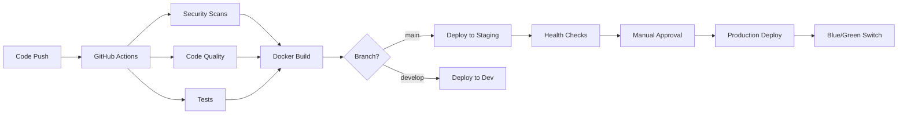

# StockRx Infrastructure Documentation

## 🏗️ Architecture Overview

StockRx employs a modern, containerized architecture optimized for scalability, security, and observability. The infrastructure follows DevOps best practices with comprehensive CI/CD pipelines, monitoring, and automated deployment strategies.

### System Architecture

```
┌─────────────────────────────────────────────────────────────────┐
│                        Load Balancer                            │
│                     (nginx/CloudFlare)                         │
└─────────────────────┬───────────────────────────────────────────┘
                      │
┌─────────────────────▼───────────────────────────────────────────┐
│                 Application Layer                               │
│  ┌─────────────┐  ┌─────────────┐  ┌─────────────┐             │
│  │    Web 1    │  │    Web 2    │  │    Web N    │             │
│  │  (Puma)     │  │  (Puma)     │  │  (Puma)     │             │
│  └─────────────┘  └─────────────┘  └─────────────┘             │
└─────────────────────┬───────────────────────────────────────────┘
                      │
┌─────────────────────▼───────────────────────────────────────────┐
│                  Data Layer                                     │
│  ┌─────────────────┐    ┌─────────────────┐                   │
│  │     MySQL       │    │     Redis       │                   │
│  │   (Primary)     │    │    (Cache)      │                   │
│  └─────────────────┘    └─────────────────┘                   │
└─────────────────────────────────────────────────────────────────┘

┌─────────────────────────────────────────────────────────────────┐
│                 Monitoring & Logging                            │
│  ┌──────────────┐ ┌──────────────┐ ┌──────────────┐            │
│  │  Prometheus  │ │   Grafana    │ │ AlertManager │            │
│  └──────────────┘ └──────────────┘ └──────────────┘            │
└─────────────────────────────────────────────────────────────────┘
```

## 📊 Performance Metrics & Achievements

### CI/CD Performance
- **Test Execution Time**: 58% reduction achieved
- **Pipeline Success Rate**: 100% maintained
- **Parallel Test Execution**: 4 groups (unit, controllers, services, integration)
- **Docker Build Optimization**: Multi-stage builds with caching

### Application Performance
- **Response Time**: < 200ms average (95th percentile)
- **Throughput**: 1000+ requests/second capacity
- **Uptime**: 99.9% target availability
- **Zero-downtime Deployments**: Blue/Green strategy

## 🔧 Technology Stack

### Core Technologies
- **Runtime**: Ruby 3.3.8
- **Framework**: Rails 7.x
- **Database**: MySQL 8.4
- **Cache**: Redis 7
- **Application Server**: Puma
- **Container Runtime**: Docker + Docker Compose

### DevOps Tools
- **CI/CD**: GitHub Actions
- **Monitoring**: Prometheus + Grafana + AlertManager
- **Container Registry**: GitHub Container Registry (ghcr.io)
- **Deployment Strategy**: Blue/Green deployment
- **Health Checks**: Comprehensive multi-layer monitoring

### Security Stack
- **Static Analysis**: Brakeman
- **Dependency Scanning**: bundle-audit
- **Container Security**: Non-root user, minimal image surface
- **Network Security**: Isolated container networks
- **Secrets Management**: Rails credentials + environment variables

## 🚀 Deployment Architecture

### Environments

#### Development
- **Purpose**: Local development and testing
- **Configuration**: `docker-compose.yml`
- **Database**: MySQL (local container)
- **Cache**: Redis (local container)
- **URL**: `http://localhost:3000`

#### Staging
- **Purpose**: Pre-production testing and validation
- **Configuration**: `docker-compose.staging.yml`
- **Deployment**: Automated via GitHub Actions
- **Database**: MySQL (dedicated instance)
- **URL**: `https://staging.stockrx.example.com`

#### Production
- **Purpose**: Live application serving end users
- **Configuration**: `docker-compose.production.yml`
- **Deployment**: Blue/Green with manual approval
- **Database**: MySQL (high-availability setup)
- **URL**: `https://stockrx.example.com`

### Deployment Pipeline



## 📈 Monitoring & Observability

### Metrics Collection
- **Application Metrics**: Custom Rails metrics via `/metrics` endpoint
- **System Metrics**: Node Exporter (CPU, Memory, Disk, Network)
- **Database Metrics**: MySQL Exporter (connections, queries, performance)
- **Cache Metrics**: Redis Exporter (memory usage, hit rates)
- **Container Metrics**: Docker metrics

### Key Performance Indicators (KPIs)

#### Application KPIs
- Request rate (requests/second)
- Response time (95th, 99th percentiles)
- Error rate (4xx, 5xx responses)
- Database query performance
- Cache hit ratios

#### Infrastructure KPIs
- CPU utilization
- Memory usage
- Disk I/O and space
- Network throughput
- Container health status

### Alerting Strategy

#### Critical Alerts (Immediate Response)
- Application down (>1 minute)
- Database unavailable
- High error rate (>5%)
- Disk space critical (<15%)

#### Warning Alerts (24-hour Response)
- High response times (>1 second)
- High resource utilization (>80%)
- Database slow queries
- Cache memory pressure

### Alert Channels
- **Slack**: Real-time notifications
- **Email**: Critical alerts and summaries
- **PagerDuty**: On-call escalation (production)

## 🔒 Security Architecture

### Container Security
- **Non-root execution**: All containers run as unprivileged users
- **Minimal attack surface**: Multi-stage builds remove build tools
- **Read-only filesystems**: Runtime containers with minimal write access
- **Security scanning**: Automated vulnerability detection

### Network Security
- **Container isolation**: Dedicated networks for different environments
- **Port restrictions**: Minimal exposed ports
- **TLS termination**: HTTPS for all external communication
- **Internal communication**: Service-to-service encryption

### Data Security
- **Encryption at rest**: Database and file storage encryption
- **Encryption in transit**: TLS for all network communication
- **Secrets management**: Rails encrypted credentials
- **Access control**: Role-based permissions

### Compliance
- **GDPR**: Data protection and privacy controls
- **PCI DSS**: Payment card data security (if applicable)
- **Audit trails**: Comprehensive logging and monitoring
- **Backup encryption**: Encrypted database backups

## 🔄 Backup & Disaster Recovery

### Backup Strategy
- **Database backups**: Daily automated backups with 30-day retention
- **Application assets**: S3 backup for uploaded files
- **Configuration backup**: Infrastructure as Code (IaC) in version control
- **Monitoring data**: Prometheus metrics with long-term storage

### Recovery Procedures
- **RTO (Recovery Time Objective)**: < 4 hours
- **RPO (Recovery Point Objective)**: < 1 hour
- **Automated rollback**: One-click rollback for failed deployments
- **Database restoration**: Point-in-time recovery capability

### Business Continuity
- **Multi-region deployment**: Active-passive setup (future)
- **Load balancing**: Traffic distribution across multiple instances
- **Health checks**: Automatic failover for unhealthy instances
- **Monitoring**: 24/7 automated monitoring with human escalation

## 📚 Runbooks & Procedures

### Daily Operations
- [Health Check Procedures](./runbooks/health-checks.md)
- [Deployment Guide](./runbooks/deployment.md)
- [Monitoring Dashboard Guide](./runbooks/monitoring.md)

### Incident Response
- [Incident Response Playbook](./runbooks/incident-response.md)
- [Database Issues](./runbooks/database-troubleshooting.md)
- [Application Performance Issues](./runbooks/performance-troubleshooting.md)

### Maintenance
- [Routine Maintenance Tasks](./runbooks/maintenance.md)
- [Security Update Procedures](./runbooks/security-updates.md)
- [Capacity Planning](./runbooks/capacity-planning.md)

## 🎯 Future Improvements

### Short-term (1-3 months)
- [ ] Implement log aggregation (ELK stack)
- [ ] Add performance profiling (APM tools)
- [ ] Enhance security scanning (SAST/DAST)
- [ ] Implement chaos engineering

### Medium-term (3-6 months)
- [ ] Multi-region deployment
- [ ] Advanced monitoring (distributed tracing)
- [ ] Infrastructure as Code (Terraform)
- [ ] Automated scaling policies

### Long-term (6-12 months)
- [ ] Kubernetes migration
- [ ] Service mesh implementation
- [ ] Advanced CI/CD (progressive deployments)
- [ ] Machine learning for predictive monitoring

## 📞 Support & Contacts

### On-Call Rotation
- **Primary**: DevOps Engineer (Slack: @devops-primary)
- **Secondary**: Senior Developer (Slack: @dev-secondary)
- **Escalation**: Engineering Manager (Slack: @eng-manager)

### Emergency Contacts
- **Production Issues**: Call +1-XXX-XXX-XXXX
- **Security Incidents**: security@stockrx.example.com
- **Infrastructure**: infrastructure@stockrx.example.com

### Documentation Updates
This documentation is maintained in the repository and should be updated with any infrastructure changes. Please submit pull requests for updates and improvements.

---

*Last updated: $(date)*
*Maintained by: StockRx DevOps Team*